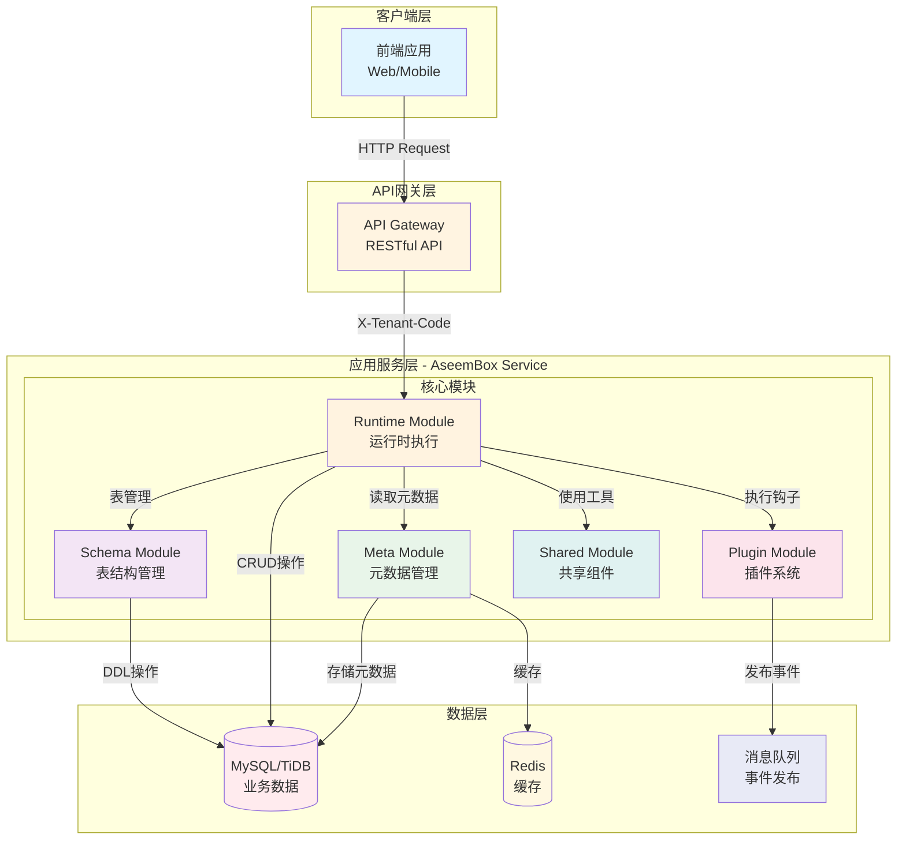
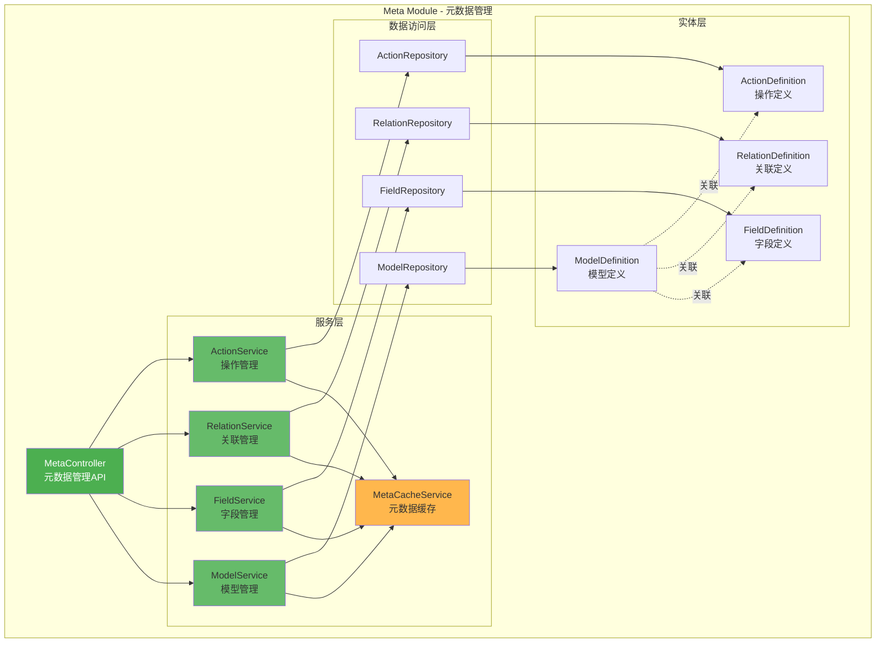
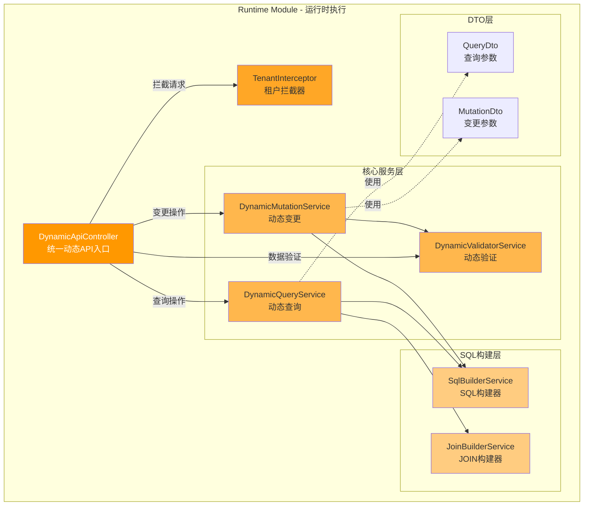
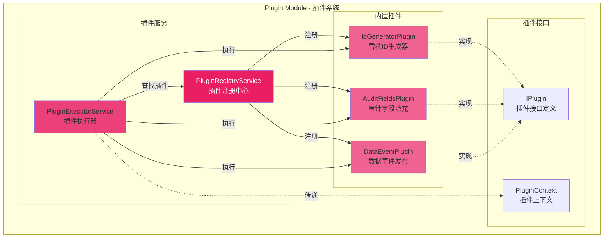
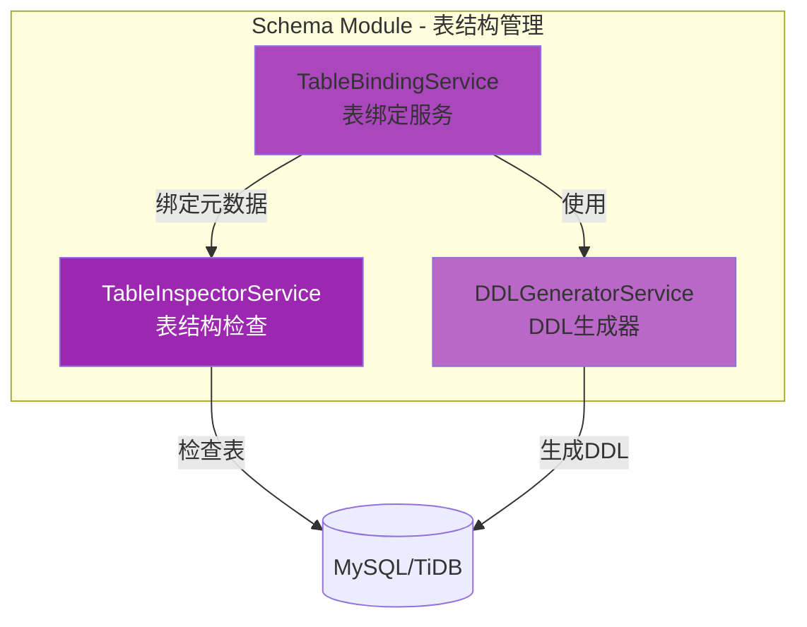
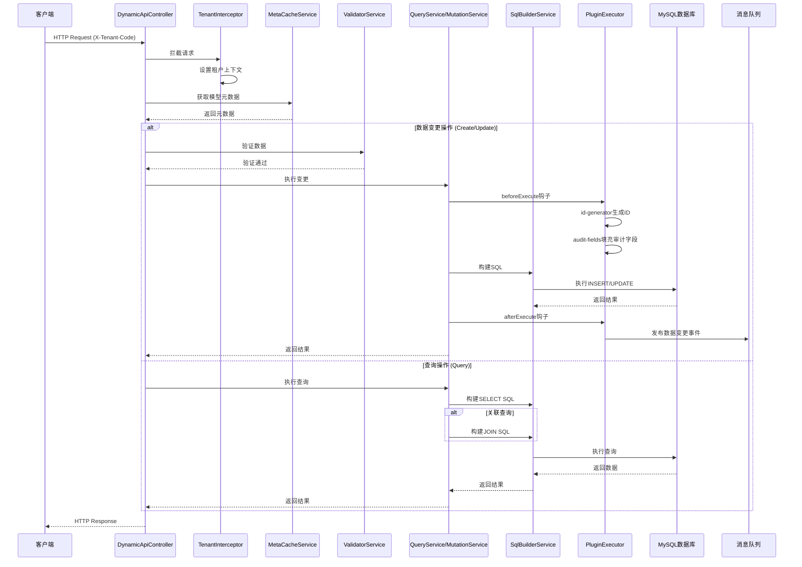
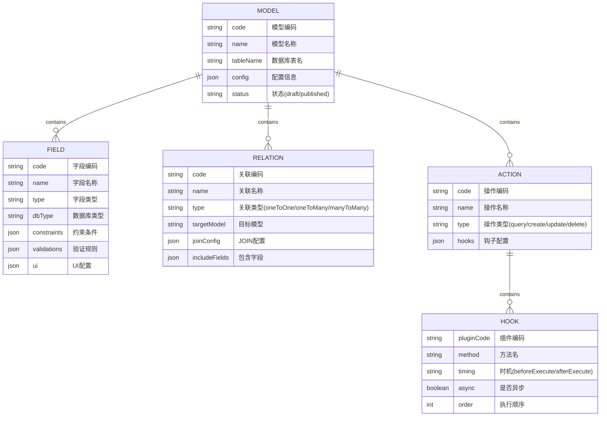
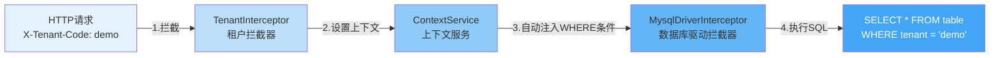

# AseemBox 低代码平台 - 架构图

## 系统整体架构



## Meta Module（元数据管理模块）详细架构



## Runtime Module（运行时模块）详细架构



## Plugin Module（插件系统）详细架构



## Schema Module（表结构管理）详细架构



## 完整数据流架构



## 核心概念模型



## 多租户隔离机制



## 技术栈

### 核心框架
- **NestJS** - Node.js 企业级框架
- **TypeScript** - 类型安全
- **TypeORM** - ORM框架（定制版）

### 数据存储
- **MySQL/TiDB** - 关系型数据库
- **Redis** - 缓存和会话存储

### 消息队列
- **MQ** - 异步事件处理

### 内部依赖
- `@cs/nest-common` - 通用组件
- `@cs/nest-typeorm` - TypeORM集成
- `@cs/nest-cloud` - 云服务集成
- `@cs/nest-config` - 配置管理
- `@cs/nest-redis` - Redis集成
- `@cs/nest-mq` - 消息队列集成

## 核心特性

### 1. 元数据驱动
- 通过元数据定义模型，无需编写代码即可实现CRUD
- 支持模型、字段、关联、操作的动态定义
- 元数据变更实时生效

### 2. 多租户隔离
- 基于请求头 `X-Tenant-Code` 自动隔离租户数据
- 所有SQL自动添加租户过滤条件
- 零侵入的租户隔离实现

### 3. 插件系统
- 支持钩子机制扩展业务逻辑
- 内置ID生成器、审计字段、数据事件三大插件
- 支持自定义插件开发

### 4. 关联查询
- 支持一对一、一对多、多对多关联
- 自动构建JOIN SQL
- 灵活的字段别名配置

### 5. 动态验证
- 基于元数据的数据验证
- 支持必填、长度、正则、自定义验证器
- 自动数据清理和类型转换

### 6. 缓存优化
- 元数据缓存，减少数据库查询
- 支持多种缓存策略
- 可配置的TTL

## API设计

### 统一的RESTful API

```
GET    /api/v1/data/:modelCode          # 分页查询
GET    /api/v1/data/:modelCode/:id      # 根据ID查询
POST   /api/v1/data/:modelCode          # 创建记录
PUT    /api/v1/data/:modelCode/:id      # 更新记录
DELETE /api/v1/data/:modelCode/:id      # 删除记录
POST   /api/v1/data/:modelCode/batch    # 批量创建
PUT    /api/v1/data/:modelCode/batch    # 批量更新
DELETE /api/v1/data/:modelCode/batch    # 批量删除
POST   /api/v1/data/:modelCode/aggregate # 聚合查询
```

### 元数据管理API

```
GET    /api/v1/meta/models              # 查询所有模型
GET    /api/v1/meta/models/:modelCode   # 查询单个模型
POST   /api/v1/meta/models              # 创建模型
PUT    /api/v1/meta/models/:modelCode   # 更新模型
DELETE /api/v1/meta/models/:modelCode   # 删除模型
POST   /api/v1/meta/models/:modelCode/publish # 发布模型
```

## 总结

AseemBox 是一个功能强大的企业级低代码平台后端服务，通过元数据驱动的方式实现了：

1. **零代码CRUD** - 通过配置元数据即可实现完整的数据操作
2. **高度可扩展** - 插件系统支持灵活的业务逻辑扩展
3. **多租户SaaS** - 原生支持多租户数据隔离
4. **关联查询** - 支持复杂的多表关联查询
5. **类型安全** - TypeScript提供完整的类型支持
6. **性能优化** - 内置缓存机制，支持高并发场景

该架构设计清晰，模块职责明确，适合快速构建企业级SaaS应用。
