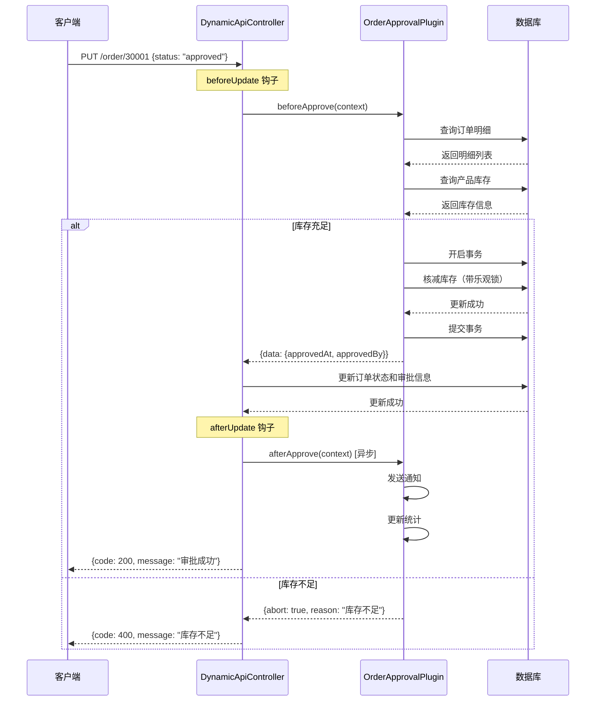

# AseemBox 业务逻辑配置指南

## 目录

1. [业务逻辑实现方式](#业务逻辑实现方式)
2. [钩子系统详解](#钩子系统详解)
3. [自定义插件开发](#自定义插件开发)
4. [完整示例：订单审批流程](#完整示例订单审批流程)
5. [最佳实践](#最佳实践)

---

## 业务逻辑实现方式

AseemBox 提供了三种方式来实现业务逻辑：

### 1. 钩子系统（Hooks System）✅ 推荐

通过在 Action 配置中添加钩子，在数据操作的不同阶段执行自定义逻辑。

**支持的钩子阶段：**

| 钩子阶段 | 说明 | 典型用途 | 是否可中止 |
|---------|------|---------|-----------|
| `beforeCreate` | 创建前 | 数据预处理、ID生成、业务验证 | ✅ 是 |
| `afterCreate` | 创建后 | 发送通知、事件发布、关联数据创建 | ❌ 否 |
| `beforeUpdate` | 更新前 | 业务验证、状态检查、权限校验 | ✅ 是 |
| `afterUpdate` | 更新后 | 状态同步、通知发送、数据一致性维护 | ❌ 否 |
| `beforeDelete` | 删除前 | 级联删除检查、关联数据验证 | ✅ 是 |
| `afterDelete` | 删除后 | 清理关联数据、发送通知 | ❌ 否 |
| `beforeQuery` | 查询前 | 动态过滤条件、权限过滤 | ✅ 是 |
| `afterQuery` | 查询后 | 数据脱敏、字段转换 | ❌ 否 |
| `onError` | 错误时 | 错误日志、异常通知、回滚补偿 | ❌ 否 |

### 2. 自定义操作（Custom Action）

对于标准 CRUD 无法满足的场景，创建自定义操作。

**支持的自定义类型：**

- **RPC** - 调用远程服务
- **MQ** - 发送消息到消息队列
- **Script** - 执行自定义脚本（计划中）

### 3. 自定义插件开发 ⭐ 最强大

编写独立的插件模块，注册到插件系统，通过钩子机制调用。

---

## 钩子系统详解

### 钩子配置结构

在 `ab_action_definition` 表中，`hooks` 字段存储钩子配置（JSON格式）：

```json
{
  "beforeExecute": [
    {
      "pluginCode": "order-approval",
      "method": "checkInventory",
      "async": false,
      "order": 1,
      "condition": "status == 'pending'"
    },
    {
      "pluginCode": "order-approval",
      "method": "deductInventory",
      "async": false,
      "order": 2
    }
  ],
  "afterExecute": [
    {
      "pluginCode": "notification",
      "method": "sendApprovalNotice",
      "async": true,
      "order": 1
    }
  ],
  "onError": [
    {
      "pluginCode": "error-handler",
      "method": "logError",
      "async": true,
      "order": 1
    }
  ]
}
```

**字段说明：**

- `pluginCode` - 插件代码（必须已注册）
- `method` - 插件方法名
- `async` - 是否异步执行（true=不等待结果，false=同步执行）
- `order` - 执行顺序（数字越小越先执行）
- `condition` - 执行条件（可选，表达式）

### 钩子上下文（HookContext）

每个钩子函数都会接收一个上下文对象：

```typescript
interface HookContext {
  // 模型信息
  modelCode: string;        // 模型代码，如 'order'
  modelId: string;          // 模型ID

  // 操作信息
  actionCode: string;       // 操作代码，如 'create', 'approve'
  stage: HookStage;         // 钩子阶段

  // 数据
  data?: Record<string, any>;  // 当前操作的数据
  result?: any;                // 操作结果（after钩子可用）
  error?: Error;               // 错误信息（onError钩子可用）

  // 请求上下文
  tenantCode: string;       // 租户代码
  userId?: string;          // 当前用户ID
  userName?: string;        // 当前用户名

  // 元数据
  metadata?: Record<string, any>; // 附加元数据
}
```

### 钩子返回值（HookResult）

钩子函数可以返回一个结果对象来影响后续流程：

```typescript
interface HookResult {
  // 是否中止后续操作（仅before钩子有效）
  abort?: boolean;

  // 中止原因
  abortReason?: string;

  // 修改后的数据（会合并到context.data）
  data?: Record<string, any>;

  // 附加元数据（会合并到context.metadata）
  metadata?: Record<string, any>;
}
```

---

## 自定义插件开发

### 插件基础结构

创建文件 `src/plugin/builtin/order-approval.plugin.ts`：

```typescript
import { Injectable, Inject } from '@nestjs/common';
import { DataSourceManagerImpl, DATA_SOURCE_MANAGER } from '@cs/nest-typeorm';
import { BasePlugin } from './base.plugin';
import { HookStage, HookContext, HookResult } from '../interfaces';

/**
 * 订单审批插件
 * 实现库存检查、库存核减、状态更新等业务逻辑
 */
@Injectable()
export class OrderApprovalPlugin extends BasePlugin {
  code = 'order-approval';
  name = '订单审批插件';
  description = '处理订单审批流程，包括库存检查和核减';
  version = '1.0.0';

  constructor(
    @Inject(DATA_SOURCE_MANAGER)
    private readonly dataSourceManager: DataSourceManagerImpl,
  ) {
    super();

    // 注册钩子
    this.registerHook(HookStage.BEFORE_UPDATE, this.beforeApprove.bind(this));
    this.registerHook(HookStage.AFTER_UPDATE, this.afterApprove.bind(this));
  }

  /**
   * 获取数据源
   */
  private getDataSource() {
    return this.dataSourceManager.getDataSource();
  }

  /**
   * 审批前钩子 - 检查库存并核减
   */
  private async beforeApprove(context: HookContext): Promise<HookResult> {
    const { data, tenantCode } = context;

    // 仅在状态变更为 'approved' 时执行
    if (data?.status !== 'approved') {
      return {}; // 不处理
    }

    try {
      const orderId = context.data?.id || context.metadata?.id;

      // 1. 查询订单明细
      const orderItems = await this.getOrderItems(orderId, tenantCode);

      if (orderItems.length === 0) {
        return {
          abort: true,
          abortReason: '订单没有明细，无法审批',
        };
      }

      // 2. 检查所有产品的库存
      const inventoryCheck = await this.checkInventory(orderItems, tenantCode);

      if (!inventoryCheck.success) {
        return {
          abort: true,
          abortReason: inventoryCheck.message,
        };
      }

      // 3. 核减库存（在事务中执行）
      await this.deductInventory(orderItems, tenantCode);

      // 4. 添加审批时间到数据
      return {
        data: {
          approvedAt: new Date(),
          approvedBy: context.userId,
        },
      };
    } catch (error) {
      return {
        abort: true,
        abortReason: `审批失败: ${error.message}`,
      };
    }
  }

  /**
   * 审批后钩子 - 发送通知、更新统计等
   */
  private async afterApprove(context: HookContext): Promise<HookResult> {
    const { data } = context;

    if (data?.status === 'approved') {
      // 发送审批通知（异步）
      this.sendApprovalNotification(context);

      // 更新客户统计（异步）
      this.updateCustomerStats(context);
    }

    return {};
  }

  /**
   * 查询订单明细
   */
  private async getOrderItems(
    orderId: string,
    tenantCode: string,
  ): Promise<any[]> {
    const sql = `
      SELECT
        product_id as productId,
        product_name as productName,
        quantity
      FROM t_order_item
      WHERE order_id = ?
        AND tenant = ?
        AND is_removed = 0
    `;

    const dataSource = this.getDataSource();
    return await dataSource.query(sql, [orderId, tenantCode]);
  }

  /**
   * 检查库存是否充足
   */
  private async checkInventory(
    orderItems: any[],
    tenantCode: string,
  ): Promise<{ success: boolean; message?: string }> {
    const productIds = orderItems.map(item => item.productId);

    // 批量查询产品库存
    const sql = `
      SELECT id, code, name, stock_qty as stockQty
      FROM t_product
      WHERE id IN (?)
        AND tenant = ?
        AND is_removed = 0
    `;

    const dataSource = this.getDataSource();
    const products = await dataSource.query(sql, [productIds, tenantCode]);

    // 构建产品库存映射
    const stockMap = new Map(
      products.map(p => [p.id, { code: p.code, name: p.name, stockQty: p.stockQty }])
    );

    // 检查每个订单项的库存
    for (const item of orderItems) {
      const product = stockMap.get(item.productId);

      if (!product) {
        return {
          success: false,
          message: `产品 ${item.productName} 不存在或已删除`,
        };
      }

      if (product.stockQty < item.quantity) {
        return {
          success: false,
          message: `产品 ${product.name}(${product.code}) 库存不足。当前库存：${product.stockQty}，需要：${item.quantity}`,
        };
      }
    }

    return { success: true };
  }

  /**
   * 核减库存（在事务中执行）
   */
  private async deductInventory(
    orderItems: any[],
    tenantCode: string,
  ): Promise<void> {
    const dataSource = this.getDataSource();
    const queryRunner = dataSource.createQueryRunner();

    await queryRunner.connect();
    await queryRunner.startTransaction();

    try {
      for (const item of orderItems) {
        // 使用乐观锁更新库存，避免并发问题
        const updateSql = `
          UPDATE t_product
          SET
            stock_qty = stock_qty - ?,
            modifier_at = NOW(),
            version_num = version_num + 1
          WHERE id = ?
            AND tenant = ?
            AND stock_qty >= ?
            AND is_removed = 0
        `;

        const result = await queryRunner.query(updateSql, [
          item.quantity,
          item.productId,
          tenantCode,
          item.quantity,
        ]);

        // 如果更新失败（受影响行数为0），说明库存不足或数据已变更
        if (result.affectedRows === 0) {
          throw new Error(`产品 ${item.productName} 库存核减失败，可能库存不足或数据已变更`);
        }
      }

      await queryRunner.commitTransaction();
    } catch (error) {
      await queryRunner.rollbackTransaction();
      throw error;
    } finally {
      await queryRunner.release();
    }
  }

  /**
   * 发送审批通知（异步）
   */
  private async sendApprovalNotification(context: HookContext): Promise<void> {
    // 实现通知逻辑（调用通知服务、发送邮件等）
    console.log(`订单审批通知: 订单 ${context.data?.orderNo} 已审批通过`);
  }

  /**
   * 更新客户统计（异步）
   */
  private async updateCustomerStats(context: HookContext): Promise<void> {
    // 实现统计更新逻辑
    console.log(`更新客户统计: 客户 ${context.data?.customerId}`);
  }
}
```

### 注册插件

在 `src/plugin/plugin.module.ts` 中注册新插件：

```typescript
import { Module, OnModuleInit } from '@nestjs/common';
import { PluginRegistryService, PluginExecutorService } from './services';
import {
  IdGeneratorPlugin,
  AuditFieldsPlugin,
  DataEventPlugin,
  OrderApprovalPlugin, // 新增
} from './builtin';

@Module({
  providers: [
    PluginRegistryService,
    PluginExecutorService,
    // 内置插件
    IdGeneratorPlugin,
    AuditFieldsPlugin,
    DataEventPlugin,
    OrderApprovalPlugin, // 新增
  ],
  exports: [
    PluginRegistryService,
    PluginExecutorService,
  ],
})
export class PluginModule implements OnModuleInit {
  constructor(
    private readonly pluginRegistry: PluginRegistryService,
    private readonly idGeneratorPlugin: IdGeneratorPlugin,
    private readonly auditFieldsPlugin: AuditFieldsPlugin,
    private readonly dataEventPlugin: DataEventPlugin,
    private readonly orderApprovalPlugin: OrderApprovalPlugin, // 新增
  ) {}

  async onModuleInit() {
    // 注册内置插件
    await this.pluginRegistry.register(this.idGeneratorPlugin);
    await this.pluginRegistry.register(this.auditFieldsPlugin);
    await this.pluginRegistry.register(this.dataEventPlugin);
    await this.pluginRegistry.register(this.orderApprovalPlugin); // 新增
  }
}
```

同时更新 `src/plugin/builtin/index.ts`：

```typescript
export * from './base.plugin';
export * from './id-generator.plugin';
export * from './audit-fields.plugin';
export * from './data-event.plugin';
export * from './order-approval.plugin'; // 新增
```

---

## 完整示例：订单审批流程

### 场景描述

实现订单审批功能，要求：

1. ✅ 查询库存表，验证库存数量是否满足订单需求
2. ✅ 如果库存不足，拒绝审批并给出提示
3. ✅ 如果库存充足，核减库存数量
4. ✅ 更新订单状态为"已审批"
5. ✅ 发送审批通知（异步）

### 步骤1：创建自定义 Action

在元数据中为订单模型添加 `approve` 操作：

```sql
INSERT INTO `ab_action_definition`
(`id`, `model_id`, `code`, `name`, `description`, `action_type`, `permissions`, `hooks`, `is_enabled`, `tenant`)
VALUES
(4205, 1003, 'approve', '审批订单', '审批销售订单，检查库存并核减', 'update',
'["order:approve"]',
'{
  "beforeExecute": [
    {
      "pluginCode": "order-approval",
      "method": "beforeApprove",
      "async": false,
      "order": 1
    },
    {
      "pluginCode": "audit-fields",
      "method": "setUpdateFields",
      "async": false,
      "order": 2
    }
  ],
  "afterExecute": [
    {
      "pluginCode": "order-approval",
      "method": "afterApprove",
      "async": true,
      "order": 1
    },
    {
      "pluginCode": "data-event",
      "method": "publishUpdate",
      "async": true,
      "order": 2
    }
  ],
  "onError": [
    {
      "pluginCode": "error-handler",
      "method": "logError",
      "async": true,
      "order": 1
    }
  ]
}',
1, 'demo');
```

### 步骤2：使用审批 API

前端调用审批接口：

```bash
# 审批订单（将状态改为 approved）
curl -X PUT "http://localhost:3030/api/v1/data/order/30001" \
  -H "X-Tenant-Code: demo" \
  -H "Content-Type: application/json" \
  -d '{
    "status": "approved"
  }'
```

### 步骤3：执行流程



### 步骤4：响应示例

**成功响应：**

```json
{
  "code": 200,
  "status": "success",
  "message": "更新成功",
  "result": {
    "success": true,
    "affected": 1,
    "id": "30001",
    "data": {
      "id": "30001",
      "orderNo": "SO20241201001",
      "customerId": "10001",
      "status": "approved",
      "approvedAt": "2024-12-01T10:30:00.000Z",
      "approvedBy": "user123",
      "totalAmount": 15000.00,
      "finalAmount": 14500.00
    }
  }
}
```

**失败响应（库存不足）：**

```json
{
  "code": 400,
  "status": "error",
  "message": "产品 笔记本电脑(P001) 库存不足。当前库存：5，需要：10"
}
```

---

## 更多复杂场景示例

### 场景1：多级审批

```typescript
// 在插件中实现多级审批逻辑
private async beforeApprove(context: HookContext): Promise<HookResult> {
  const { data, userId, metadata } = context;

  // 获取当前审批级别
  const currentLevel = metadata?.approvalLevel || 1;
  const maxLevel = 3; // 三级审批

  // 检查当前用户是否有该级别的审批权限
  const hasPermission = await this.checkApprovalPermission(userId, currentLevel);

  if (!hasPermission) {
    return {
      abort: true,
      abortReason: `您没有第${currentLevel}级审批权限`,
    };
  }

  // 如果还有下一级，状态设为待下级审批
  if (currentLevel < maxLevel) {
    return {
      data: {
        status: `level${currentLevel}_approved`,
        [`approver${currentLevel}`]: userId,
        [`approvedAt${currentLevel}`]: new Date(),
      },
      metadata: {
        approvalLevel: currentLevel + 1,
      },
    };
  }

  // 最后一级审批，执行业务逻辑
  return this.finalApprove(context);
}
```

### 场景2：条件执行

在钩子配置中使用 `condition` 字段：

```json
{
  "beforeExecute": [
    {
      "pluginCode": "discount-calculator",
      "method": "calculateDiscount",
      "async": false,
      "order": 1,
      "condition": "totalAmount > 10000"
    },
    {
      "pluginCode": "vip-benefits",
      "method": "applyVipDiscount",
      "async": false,
      "order": 2,
      "condition": "customer.level == 'VIP'"
    }
  ]
}
```

### 场景3：关联数据处理

```typescript
// 创建订单时自动创建订单明细
private async afterCreate(context: HookContext): Promise<HookResult> {
  const { data, tenantCode } = context;

  // 从 metadata 中获取订单明细
  const items = context.metadata?.items || [];

  if (items.length > 0) {
    await this.createOrderItems(data.id, items, tenantCode);
  }

  return {};
}

private async createOrderItems(
  orderId: string,
  items: any[],
  tenantCode: string,
): Promise<void> {
  const sql = `
    INSERT INTO t_order_item
    (id, order_id, product_id, product_name, quantity, unit_price, amount, tenant)
    VALUES ?
  `;

  const values = items.map(item => [
    this.generateId(),
    orderId,
    item.productId,
    item.productName,
    item.quantity,
    item.unitPrice,
    item.quantity * item.unitPrice,
    tenantCode,
  ]);

  const dataSource = this.getDataSource();
  await dataSource.query(sql, [values]);
}
```

### 场景4：数据验证

```typescript
// 自定义业务验证
private async beforeCreate(context: HookContext): Promise<HookResult> {
  const { data, tenantCode } = context;

  // 验证客户是否存在且状态正常
  const customer = await this.getCustomer(data.customerId, tenantCode);

  if (!customer) {
    return {
      abort: true,
      abortReason: '客户不存在',
    };
  }

  if (customer.status !== 'active') {
    return {
      abort: true,
      abortReason: '客户状态异常，无法创建订单',
    };
  }

  // 验证客户信用额度
  if (data.totalAmount > customer.creditLimit) {
    return {
      abort: true,
      abortReason: `超出客户信用额度。信用额度：${customer.creditLimit}，订单金额：${data.totalAmount}`,
    };
  }

  return {};
}
```

---

## 最佳实践

### 1. 钩子设计原则

✅ **DO（推荐）：**

- Before 钩子用于验证和预处理
- After 钩子用于通知和数据同步
- 耗时操作使用 `async: true` 异步执行
- 关键业务逻辑使用事务保证一致性
- 使用乐观锁避免并发问题

❌ **DON'T（不推荐）：**

- 在 After 钩子中执行关键业务逻辑
- 在钩子中进行复杂的嵌套查询
- 在同步钩子中执行耗时操作
- 忽略错误处理

### 2. 插件开发建议

```typescript
// ✅ 好的实践
class MyPlugin extends BasePlugin {
  // 使用依赖注入
  constructor(
    @Inject(DATA_SOURCE_MANAGER) private dataSourceManager: DataSourceManagerImpl,
    private logger: Logger,
  ) {
    super();
  }

  // 详细的错误处理
  private async myHook(context: HookContext): Promise<HookResult> {
    try {
      // 业务逻辑
      const result = await this.doSomething(context);
      return { data: result };
    } catch (error) {
      this.logger.error(`钩子执行失败: ${error.message}`, error.stack);
      return {
        abort: true,
        abortReason: `处理失败: ${error.message}`,
      };
    }
  }

  // 使用事务
  private async updateWithTransaction() {
    const dataSource = this.getDataSource();
    const queryRunner = dataSource.createQueryRunner();

    await queryRunner.connect();
    await queryRunner.startTransaction();

    try {
      // 操作1
      await queryRunner.query(sql1, params1);
      // 操作2
      await queryRunner.query(sql2, params2);

      await queryRunner.commitTransaction();
    } catch (error) {
      await queryRunner.rollbackTransaction();
      throw error;
    } finally {
      await queryRunner.release();
    }
  }
}
```

### 3. 性能优化

- 批量操作代替循环单次操作
- 使用索引优化查询
- 缓存频繁访问的数据
- 异步处理非关键业务

```typescript
// ❌ 不好的实践 - 循环查询
for (const item of items) {
  const product = await this.getProduct(item.productId);
  // 处理...
}

// ✅ 好的实践 - 批量查询
const productIds = items.map(item => item.productId);
const products = await this.getProductsByIds(productIds);
const productMap = new Map(products.map(p => [p.id, p]));

for (const item of items) {
  const product = productMap.get(item.productId);
  // 处理...
}
```

### 4. 测试建议

为插件编写单元测试：

```typescript
describe('OrderApprovalPlugin', () => {
  let plugin: OrderApprovalPlugin;
  let dataSourceMock: any;

  beforeEach(() => {
    dataSourceMock = {
      query: jest.fn(),
      createQueryRunner: jest.fn(),
    };

    plugin = new OrderApprovalPlugin(dataSourceMock);
  });

  it('should abort when inventory is insufficient', async () => {
    // Mock 数据
    dataSourceMock.query
      .mockResolvedValueOnce([{ productId: '1', quantity: 10 }]) // 订单明细
      .mockResolvedValueOnce([{ id: '1', stockQty: 5 }]); // 库存不足

    const context: HookContext = {
      modelCode: 'order',
      actionCode: 'approve',
      stage: HookStage.BEFORE_UPDATE,
      data: { id: '1', status: 'approved' },
      tenantCode: 'demo',
    };

    const result = await plugin['beforeApprove'](context);

    expect(result.abort).toBe(true);
    expect(result.abortReason).toContain('库存不足');
  });
});
```

---

## 总结

AseemBox 通过 **钩子系统 + 插件机制** 提供了强大的业务逻辑扩展能力：

| 场景 | 推荐方案 | 复杂度 |
|------|---------|-------|
| 简单验证、数据转换 | 使用内置插件 | ⭐ |
| 多表查询、状态检查 | 开发自定义插件 | ⭐⭐ |
| 复杂业务流程（如审批） | 自定义插件 + 钩子编排 | ⭐⭐⭐ |
| 远程服务调用 | Custom Action (RPC) | ⭐⭐ |
| 异步消息处理 | Custom Action (MQ) | ⭐⭐ |

对于你提到的**订单审批场景**，完全可以通过编写 `OrderApprovalPlugin` 插件，配合钩子机制实现：

1. ✅ 在 `beforeUpdate` 钩子中检查库存
2. ✅ 库存不足时通过 `abort: true` 中止操作
3. ✅ 库存充足时核减库存（使用事务和乐观锁）
4. ✅ 在 `afterUpdate` 钩子中异步发送通知

这种设计既保证了灵活性，又保持了代码的可维护性和可测试性。
