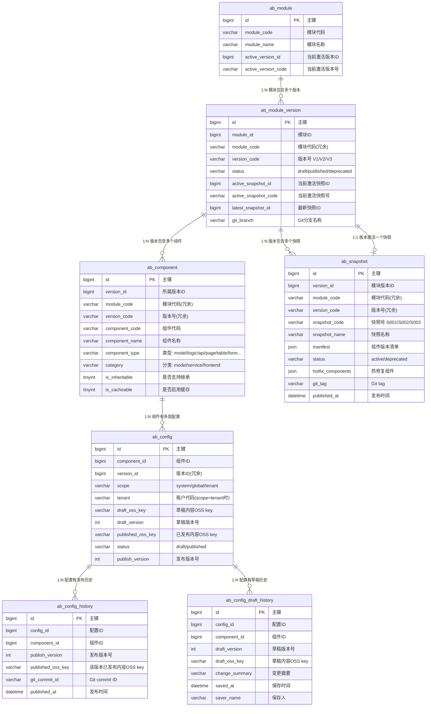

# 存储层设计

> **状态**: 设计中
> **更新日期**: 2025-01-30

---

## 目录

1. [概述](#1-概述)
2. [数据流架构](#2-数据流架构)
3. [表结构设计](#3-表结构设计)
4. [组件类型扩展规范](#4-组件类型扩展规范)
5. [OSS 存储设计](#5-oss-存储设计)
6. [配置设计](#6-配置设计)
7. [缓存策略](#7-缓存策略)
8. [快照管理设计](#8-快照管理设计)
9. [版本管理设计](#9-版本管理设计)
10. [设计决策记录与相关文档](#10-设计决策记录与相关文档)

---

## 1. 概述

### 1.1 核心概念模型

```
┌─────────────────────────────────────────────────────────────────────────────┐
│                              模块 (Module)                                   │
│                            最小配置管理单元                                   │
└─────────────────────────────────────────────────────────────────────────────┘
                                      │
              ┌───────────────────────┼───────────────────────┐
              ▼                       ▼                       ▼
        ┌───────────┐           ┌───────────┐           ┌───────────┐
        │    V1     │           │    V2     │           │    V3     │
        └───────────┘           └───────────┘           └───────────┘
              │
              │  版本对应代码分支，解决开发协同问题，部署可发布多个版本
              ▼
┌─────────────────────────────────────────────────────────────────────────────┐
│                        快照 (Snapshot) - 版本一致性保证                       │
│                                                                             │
│  ┌─────────────────────────────────────────────────────────────────────┐   │
│  │  Snapshot S003 (2025-01-22)                                         │   │
│  │                                                                     │   │
│  │    model/order_model    → publish_version: 5                       │   │
│  │    table/order_table    → publish_version: 3                       │   │
│  │    form/order_form      → publish_version: 4                       │   │
│  │    page/order_page      → publish_version: 6                       │   │
│  │                                                                     │   │
│  │  快照锁定一组组件的发布版本，确保运行时加载的配置相互兼容              │   │
│  └─────────────────────────────────────────────────────────────────────┘   │
│                                                                             │
└─────────────────────────────────────────────────────────────────────────────┘
              │
              ▼
┌─────────────────────────────────────────────────────────────────────────────┐
│                    配置层级 (每个版本内部按层级划分)                           │
│                                                                             │
│  ┌─────────────────────────────────────────────────────────────────────┐   │
│  │                                                                     │   │
│  │   ┌─────────────┐    ┌─────────────┐    ┌─────────────┐           │   │
│  │   │   租户层     │    │   全局层     │    │   系统层     │           │   │
│  │   │  (tenant)   │ ←  │  (global)   │ ←  │  (system)   │           │   │
│  │   └─────────────┘    └─────────────┘    └─────────────┘           │   │
│  │                                                                     │   │
│  │   不同层级之间，以组件粒度继承                                        │   │
│  │   继承方向: 租户 ← 全局 ← 系统                                       │   │
│  └─────────────────────────────────────────────────────────────────────┘   │
│                                                                             │
└─────────────────────────────────────────────────────────────────────────────┘
                      │
                      ▼
┌─────────────────────────────────────────────────────────────────────────────┐
│                      组件 (Component) - 最小配置单元                         │
│                                                                             │
│  ┌─────────────┐     ┌─── 数据模型配置 (model)  ← 组件级继承                │
│  │  数据模型    │─────┤    模型是实体的集合，作为属性骨架被其他组件引用        │
│  └─────────────┘     │    JSON中包含多个实体定义                            │
│                      │                                                     │
│  ┌─────────────┐     ┌─── 逻辑编排配置 (logic)  ← 组件级继承                │
│  │  服务端配置  │─────┤                                                     │
│  └─────────────┘     └─── API接口配置 (api)     ← 组件级继承                │
│                                                                             │
│  ┌─────────────┐     ┌─── 主页面配置 (page)     ← 组件级继承                │
│  │  前端配置    │─────┼─── 表格配置 (table)      ← 组件级继承                │
│  └─────────────┘     ├─── 表单配置 (form)       ← 组件级继承                │
│                      ├─── 过滤器配置 (filter)    ← 组件级继承                │
│                      └─── 打印导出配置 (export)  ← 组件级继承                │
│                      └─── ... (可扩展)                                      │
└─────────────────────────────────────────────────────────────────────────────┘
```

### 1.2 继承规则

**组件级继承，受 `is_inheritable` 属性控制**

```
继承链 (is_inheritable=1): 租户层 ← 全局层 ← 系统层
无继承 (is_inheritable=0): 仅系统层

示例1：租户 T001 请求 order 模块 V1 版本的 "order_main" 实体配置 (可继承)

1. 查找租户层是否有 order_main 实体配置 → 有则使用
2. 没有则查找全局层 order_main 实体配置 → 有则使用
3. 没有则使用系统层 order_main 实体配置 (必须存在)

示例2：请求某个系统级配置 (不可继承, is_inheritable=0)

1. 直接查找系统层配置 → 返回
2. 不查找 global/tenant 层
```

| 配置分类 | 组件类型 | is_inheritable | is_cacheable | 说明 |
|---------|---------|:-------------:|:------------:|------|
| 数据模型 | model | 1 (默认) | 1 (默认) | 可覆盖模型配置，可新增模型 |
| 服务端 | logic / api | 1 (默认) | 1 (默认) | 可覆盖配置，可新增 |
| 前端 | page / table / form 等 | 1 (默认) | 1 (默认) | 可覆盖配置，可新增 |
| 系统配置 | system_config | 0 | 0 | 仅 system 层，不缓存 |

> **设计说明**:
> - `is_inheritable=0` 的组件只能在 system 层创建配置
> - `is_cacheable=0` 的组件每次请求都从数据库读取，适用于需要实时性的配置
> - 两个属性默认都是 1，大多数组件支持完整的继承和缓存机制

### 1.3 技术选型

| 组件 | 技术 | 用途 |
|-----|------|-----|
| 主数据库 | TiDB | 元数据、组件注册表、配置索引 |
| 对象存储 | OSS | 存储配置JSON内容（体积大） |
| 缓存 | Redis | 运行时配置缓存、合并结果缓存 |
| 版本控制 | Gitea | 配置版本历史、审计备份 |

### 1.4 设计原则

1. **TiDB 存索引，OSS 存内容** - 配置JSON体积大，分离存储
2. **统一组件注册表** - 所有配置单元统一管理，便于继承查找
3. **运行时合并** - 配置继承在运行时按需计算
4. **组件类型可扩展** - 存储层只定义规则，具体类型可扩展
5. **快照保证一致性** - 打包发布生成快照，锁定组件版本，确保运行时配置兼容

---

## 2. 数据流架构

### 2.1 整体架构

```
┌─────────────────────────────────────────────────────────────────────────────┐
│                                设计器                                        │
└─────────────────────────────────────────────────────────────────────────────┘
                                      │
                                      ▼ 保存/打包发布
┌─────────────────────────────────────────────────────────────────────────────┐
│                             TiDB (索引存储)                                  │
│                                                                             │
│  ┌─────────────┐  ┌─────────────┐  ┌─────────────┐  ┌─────────────┐         │
│  │ ab_module   │  │ ab_version  │  │ab_component │  │ ab_config   │         │
│  │  模块定义    │──▶│  版本定义  │  │  组件注册   │  │  配置索引    │         │
│  └─────────────┘  └──────┬──────┘  └─────────────┘  └──────┬──────┘         │
│                          │                                 │                │
│                          ▼                                 │                │
│                 ┌─────────────────┐                        │                │
│                 │ab_build_pipeline│◀───────────────────────┘                │
│                 │  构建流水线      │                                         │
│                 │ (frontend/backend)                                        │
│                 └────────┬────────┘                                         │
│                          │                                                  │
│          ┌───────────────┼───────────────────┐                              │
│          ▼               ▼                   ▼                              │
│  ┌─────────────┐  ┌─────────────┐  ┌─────────────────┐                      │
│  │ab_snapshot  │  │ab_tenant_   │  │ab_config_history│                      │
│  │  快照表      │  │  snapshot   │  │   发布历史       │                      │
│  │(版本一致性)  │  │(灰度发布用)  │  └─────────────────┘                      │
│  └─────────────┘  └─────────────┘                                           │
│                                                                             │
└─────────────────────────────────────────────────────────────────────────────┘
                                      │
                                      │ oss_key
                                      ▼
┌─────────────────────────────────────────────────────────────────────────────┐
│                             OSS (内容存储)                                   │
│                                                                             │
│  ┌─────────────────┐  ┌─────────────────┐  ┌─────────────────┐             │
│  │     draft/      │  │  draft-history/ │  │   published/    │             │
│  │   当前草稿       │  │    草稿历史      │  │    已发布配置    │             │
│  │  (设计器编辑)    │  │   (版本回退)     │  │   (运行时读取)   │             │
│  └─────────────────┘  └─────────────────┘  └─────────────────┘             │
│                                                                             │
└─────────────────────────────────────────────────────────────────────────────┘
                                      │
                    ┌─────────────────┼─────────────────┐
                    ▼                                   ▼
          ┌─────────────────┐                 ┌─────────────────┐
          │     Redis       │                 │     Gitea       │
          │   运行时缓存     │                 │   发布历史       │
          │   合并结果缓存   │                 │   审计备份       │
          └─────────────────┘                 └─────────────────┘
                    │
                    ▼
┌─────────────────────────────────────────────────────────────────────────────┐
│                              前端渲染器                                      │
└─────────────────────────────────────────────────────────────────────────────┘
```

**架构说明：**

| 组件 | 职责 | 草稿历史相关 |
|-----|------|-------------|
| TiDB | 存储索引和元数据 | `ab_config_draft_history` 记录草稿版本历史 |
| OSS draft/ | 存储当前草稿 | 设计器编辑的最新版本 |
| OSS draft-history/ | 存储草稿历史 | 每次保存前归档，支持版本回退 |
| OSS published/ | 存储已发布配置 | 运行时读取，与草稿隔离 |
| Gitea | 发布历史备份 | 仅同步已发布配置，不包含草稿历史 |

### 2.2 数据流说明

| 场景 | 数据流 |
|-----|-------|
| 保存草稿 | 设计器 → **归档当前草稿到历史** → OSS(**草稿路径**) → TiDB(draft_version++) |
| 打包发布 | 生成快照(ab_snapshot) → 批量发布组件 → OSS(草稿→发布路径) → TiDB(status=published) → Redis(清除) → Gitea(异步) |
| 运行时读取 | 获取激活快照 → Redis缓存 → (miss) → 按快照清单加载 → OSS(**发布路径**) → 写入缓存 |
| 草稿回退 | ab_config_draft_history → OSS(draft-history) → 恢复到草稿路径 |
| 快照回滚 | 切换激活快照 → Redis(清除缓存) → 运行时自动加载旧快照的组件版本 |

> **关键设计**:
> - 草稿和已发布配置使用独立的 OSS key 字段，支持同时保存两个版本
> - **草稿每次保存时，当前内容会先归档到历史**，支持设计过程中的版本回退

**双字段设计说明**:

| 字段 | 用途 | 写入时机 | 读取场景 |
|-----|------|---------|---------|
| `draft_oss_key` | 草稿内容 | 设计器保存时 | 预览、继续编辑 |
| `published_oss_key` | 已发布内容 | 发布时从 draft 复制 | 运行时、代码生成 |

**场景示例**:

| 场景 | draft_oss_key | published_oss_key | status |
|-----|--------------|-------------------|--------|
| 新建配置 | 有值 | 空 | draft |
| 首次发布 | 有值 | 有值（从draft复制）| published |
| 发布后继续编辑 | 更新 | 保持不变 | published |
| 再次发布 | 有值 | 更新（从draft复制）| published |

### 2.3 数据流向图

#### 2.3.1 保存草稿流程

```
┌──────────┐
│  设计器   │
└────┬─────┘
     │ ① 保存请求
     ▼
┌──────────────────────────────────────────────────────────────────────┐
│                              服务层                                    │
│                                                                       │
│  ┌─────────────────────────────────────────────────────────────────┐ │
│  │ ② 归档当前草稿到历史（如果存在）                                    │ │
│  │                                                                  │ │
│  │   OSS: draft/ → draft-history/xxx_v{N}.json                     │ │
│  │   TiDB: INSERT INTO ab_config_draft_history                     │ │
│  └─────────────────────────────────────────────────────────────────┘ │
│                              │                                        │
│                              ▼                                        │
│  ┌─────────────────────────────────────────────────────────────────┐ │
│  │ ③ 保存新草稿                                                      │ │
│  │                                                                  │ │
│  │   OSS: 上传到 draft/ 路径                                         │ │
│  │   TiDB: UPDATE ab_config SET draft_version++                    │ │
│  └─────────────────────────────────────────────────────────────────┘ │
│                                                                       │
└───────────────────────────────────────────────────────────────────────┘
```

> **注意**:
> - 草稿内容存储在 `draft/` 子目录下，与发布内容隔离
> - **每次保存前，当前草稿会被复制到 `draft-history/` 目录**，确保历史可追溯

#### 2.3.2 打包发布流程

```
┌──────────┐
│  设计器   │
└────┬─────┘
     │ ① 打包发布请求（选择流水线 + 要发布的组件）
     │    pipeline_code: frontend 或 backend
     ▼
┌──────────────────────────────────────────────────────────────────────┐
│                              服务层                                    │
│                                                                       │
│  ┌─────────────────────────────────────────────────────────────────┐ │
│  │ ② 获取/创建流水线                                                  │ │
│  │                                                                  │ │
│  │   - 查询 ab_build_pipeline (version_id, pipeline_code)           │ │
│  │   - 若不存在则创建                                                │ │
│  └─────────────────────────────────────────────────────────────────┘ │
│                              │                                        │
│                              ▼                                        │
│  ┌─────────────────────────────────────────────────────────────────┐ │
│  │ ③ 生成快照                                                        │ │
│  │                                                                  │ │
│  │   - 生成快照号 (S001, S002...)                                   │ │
│  │   - 收集流水线对应 category 组件的 publish_version                │ │
│  │   - 构建 manifest (仅含该流水线的组件)                            │ │
│  │   - 写入 ab_snapshot 表 (关联 pipeline_id)                       │ │
│  └─────────────────────────────────────────────────────────────────┘ │
│                              │                                        │
│                              ▼                                        │
│  ┌─────────────────────────────────────────────────────────────────┐ │
│  │ ④ 批量发布组件                                                    │ │
│  │                                                                  │ │
│  │   FOR EACH 待发布组件 (属于该流水线 category):                     │ │
│  │     - OSS: 复制 draft/ → published/                              │ │
│  │     - TiDB: UPDATE ab_config SET status='published',            │ │
│  │             publish_version++, published_oss_key=...            │ │
│  │     - 记录 ab_config_history                                     │ │
│  └─────────────────────────────────────────────────────────────────┘ │
│                              │                                        │
│                              ▼                                        │
│  ┌─────────────────────────────────────────────────────────────────┐ │
│  │ ⑤ 激活快照                                                        │ │
│  │                                                                  │ │
│  │   - UPDATE ab_build_pipeline SET active_snapshot_id = ?         │ │
│  │     WHERE version_id = ? AND pipeline_code = ?                  │ │
│  └─────────────────────────────────────────────────────────────────┘ │
│                                                                       │
└───────────────────────────────────────────────────────────────────────┘
     │
     │ ⑥ 清除缓存
     ▼
┌──────────┐
│  Redis   │  DEL assembox:{tenant}:resolved:...
└────┬─────┘
     │
     │ ⑦ 异步备份 (消息队列)
     ▼
┌──────────┐
│  Gitea   │  git commit + push, git tag {module}/{version}/{pipeline}/{snapshot}
└──────────┘
```

> **关键设计**:
> - 打包发布按**流水线**进行，前端和后端独立发布
> - 快照关联到流水线（pipeline_id），同一流水线下快照号递增
> - manifest 只包含该流水线对应 category 的组件

#### 2.3.3 构建时读取流程

> **构建时读取**：发布构建时读取构建时配置（`is_runtime=0`），用于生成代码

```
┌──────────────┐
│   构建服务    │
└──────┬───────┘
       │ ① 构建请求 (module, version, pipeline_code, tenant)
       │    pipeline_code: frontend 或 backend
       ▼
┌──────────────────────────────────────────────────────────────────────┐
│                              服务层                                    │
│                                                                       │
│  ┌─────────────────────────────────────────────────────────────────┐ │
│  │ ② 获取流水线激活快照                                               │ │
│  │                                                                  │ │
│  │   - 查询 ab_build_pipeline 获取 active_snapshot_id               │ │
│  │   - 从 ab_snapshot 获取快照的 manifest                           │ │
│  │   - manifest 只包含该流水线 category 的组件                       │ │
│  └─────────────────────────────────────────────────────────────────┘ │
│                              │                                        │
│                              ▼                                        │
│  ┌─────────────────────────────────────────────────────────────────┐ │
│  │ ③ 遍历 manifest.components                                       │ │
│  │                                                                  │ │
│  │   FOR EACH component in manifest:                                │ │
│  │     - 获取 publishedOssKey                                       │ │
│  │     - 按继承规则查找 tenant > global > system 层覆盖              │ │
│  └─────────────────────────────────────────────────────────────────┘ │
│                              │                                        │
│                              ▼                                        │
│  ┌─────────────────────────────────────────────────────────────────┐ │
│  │ ④ 从 OSS 批量读取配置内容                                         │ │
│  │                                                                  │ │
│  │   - 读取 published/ 路径下的配置 JSON                             │ │
│  │   - 不走 Redis 缓存（构建过程一次性读取）                          │ │
│  └─────────────────────────────────────────────────────────────────┘ │
│                              │                                        │
│                              ▼                                        │
│  ┌─────────────────────────────────────────────────────────────────┐ │
│  │ ⑤ 生成代码                                                        │ │
│  │                                                                  │ │
│  │   - 根据配置生成前端/后端代码                                     │ │
│  │   - 打包成可部署的制品                                            │ │
│  └─────────────────────────────────────────────────────────────────┘ │
│                                                                       │
└───────────────────────────────────────────────────────────────────────┘
       │
       ▼ ⑥ 部署制品
┌──────────────┐
│   部署服务    │
└──────────────┘
```

> **关键逻辑**:
> 1. 构建时读取**不走 Redis 缓存**，一次性批量从 OSS 读取
> 2. 从**流水线**获取激活快照，manifest 只含该流水线 category 的组件
> 3. 版本由快照 manifest 锁定，保证构建一致性
> 4. 构建结果（生成的代码）被打包部署，运行时不再动态加载这些配置

#### 2.3.4 运行时读取流程

> **运行时读取**：应用运行时加载运行时配置（`is_runtime=1`），如 filter、export、print

```
┌──────────┐
│  渲染器   │
└────┬─────┘
     │ ① 请求运行时配置 (module, version, componentType, componentCode, tenant)
     ▼
┌──────────┐      ② 查询组件特性       ┌──────────┐
│  服务层   │ ─────────────────────▶   │   TiDB   │
└────┬─────┘                          │ab_component│
     │                                │ is_runtime │
     │◀───────────────────────────────│is_cacheable│
     │                                └────────────┘
     │
     │          ┌────────────────────────────────────┐
     │          │ 验证 is_runtime=1（运行时配置）       │
     │          │ 运行时配置不走快照，直接按版本加载     │
     │          └────────────────────────────────────┘
     │
     │               ┌─────────────────┴─────────────────┐
     │               │                                   │
     │         is_cacheable=1                     is_cacheable=0
     │               │                                   │
     │               ▼                                   │
     │        ③ 查询缓存                                 │
     │   key不含快照: assembox:runtime:{tenant}:...      │
     │               │                                   │
     │      ┌────────┴────────┐                         │
     │      │                 │                         │
     │    命中              未命中                       │
     │      │                 │                         │
     │      ▼                 ▼                         ▼
     │ ┌──────────┐    ④ 按继承规则加载           ④ 按继承规则加载
     │ │ 返回配置  │          │                         │
     │ └──────────┘          ▼                         ▼
     │                  ┌──────────────────────────────────────┐
     │                  │ 查询 ab_config 表（只查 published）    │
     │                  │ 按层级继承规则查找 (tenant>global>system)│
     │                  └──────────────┬───────────────────────┘
     │                                 │
     │                        ⑤ 获取OSS内容
     │                                 ▼
     │                            ┌──────────┐
     │                            │   OSS    │
     │                            │ 发布路径  │
     │                            └────┬─────┘
     │                                 │
     │                        ⑥ 写入缓存 (is_cacheable=1)
     │                                 ▼
     │                            ┌──────────┐
     │◀───────────────────────────│  Redis   │
     │         ⑦ 返回配置         └──────────┘
     ▼
┌──────────┐
│  渲染页面 │
└──────────┘
```

> **关键逻辑**:
> 1. 运行时配置**不走快照**，版本只和模块版本有关
> 2. 根据 `is_cacheable` 决定是否走缓存，**缓存 key 不包含快照标识**
> 3. 根据 `is_inheritable` 决定是按层级查找还是仅查 system 层
> 4. 运行时配置支持**热更新**：发布后立即生效，无需重新构建

**两种读取流程对比：**

| 对比项 | 构建时读取 | 运行时读取 |
|-------|-----------|-----------|
| 触发时机 | 发布构建时 | 应用运行时 |
| 配置类型 | is_runtime=0 | is_runtime=1 |
| 典型配置 | model, page, table, form | filter, export, print |
| 版本来源 | 快照 manifest 锁定 | 仅模块版本 |
| Redis 缓存 | ❌ 不需要 | ✅ 需要 |
| 缓存 Key | - | `assembox:runtime:{tenant}:...` |
| 继承支持 | ✅ 支持 | ✅ 支持 |
| 热更新 | ❌ 需重新构建部署 | ✅ 发布后立即生效 |

#### 2.3.5 快照回滚流程

```
┌──────────┐
│  管理后台 │
└────┬─────┘
     │ ① 回滚请求 (指定流水线 + 目标快照号，如 frontend/S002)
     ▼
┌──────────────────────────────────────────────────────────────────────┐
│                              服务层                                    │
│                                                                       │
│  ┌─────────────────────────────────────────────────────────────────┐ │
│  │ ② 验证目标快照                                                    │ │
│  │                                                                  │ │
│  │   - 检查 ab_snapshot 中目标快照是否存在（属于该流水线）             │ │
│  │   - 检查快照状态是否为 active（非 deprecated）                     │ │
│  └─────────────────────────────────────────────────────────────────┘ │
│                              │                                        │
│                              ▼                                        │
│  ┌─────────────────────────────────────────────────────────────────┐ │
│  │ ③ 切换激活快照                                                    │ │
│  │                                                                  │ │
│  │   UPDATE ab_build_pipeline                                       │ │
│  │   SET active_snapshot_id = {目标快照ID}                           │ │
│  │   WHERE version_id = ? AND pipeline_code = ?                     │ │
│  └─────────────────────────────────────────────────────────────────┘ │
│                                                                       │
└───────────────────────────────────────────────────────────────────────┘
     │
     │ ④ 清除缓存
     ▼
┌──────────┐
│  Redis   │  DEL assembox:{pipeline}:{snapshot}:*  (清除快照相关缓存)
└────┬─────┘
     │
     │ ⑤ 记录回滚操作 (审计日志)
     ▼
┌──────────┐
│  Gitea   │  git commit: "[rollback] frontend: S003 -> S002"
└──────────┘
```

> **快照回滚优势**:
> - **原子性** - 一次操作恢复所有组件到一致状态
> - **无需恢复 OSS 文件** - 历史快照的 manifest 指向原有 OSS 文件
> - **秒级回滚** - 只需切换激活快照 ID 并清除缓存
> - **可追溯** - 快照历史清晰记录每次发布状态

---

## 3. 表结构设计

### 3.1 模块表 (ab_module)

```sql
CREATE TABLE ab_module (
    -- 主键
    id              BIGINT NOT NULL COMMENT '主键',

    -- 模块标识
    module_code     VARCHAR(100) NOT NULL COMMENT '模块代码',
    module_name     VARCHAR(200) NOT NULL COMMENT '模块名称',
    description     VARCHAR(500) COMMENT '模块描述',

    -- 当前激活版本
    active_version_id   BIGINT COMMENT '当前激活版本ID',
    active_version_code VARCHAR(20) COMMENT '当前激活版本号',

    -- 审计字段 (BaseEntity)
    created_at      DATETIME DEFAULT CURRENT_TIMESTAMP,
    creator_id      BIGINT,
    creator_name    VARCHAR(50),
    modifier_at     DATETIME DEFAULT CURRENT_TIMESTAMP ON UPDATE CURRENT_TIMESTAMP,
    modifier_id     BIGINT,
    modifier_name   VARCHAR(50),
    is_removed      TINYINT(1) DEFAULT 0,
    version         BIGINT DEFAULT 0,

    -- 启用/排序 (HasEnableEntity)
    sort_code       INT,
    is_enable       TINYINT(1) DEFAULT 1,

    PRIMARY KEY (id)
) COMMENT '模块定义表';
```

### 3.2 版本表 (ab_module_version)
```sql
CREATE TABLE ab_module_version (
    -- 主键
    id              BIGINT NOT NULL COMMENT '主键',

    -- 关联模块
    module_id       BIGINT NOT NULL COMMENT '模块ID',
    module_code     VARCHAR(100) NOT NULL COMMENT '模块代码（冗余）',

    -- 版本信息
    version_code    VARCHAR(20) NOT NULL COMMENT '版本号，如 V1、V2、V3',
    version_name    VARCHAR(100) COMMENT '版本名称',
    description     VARCHAR(500) COMMENT '版本说明',

    -- 版本状态
    status          VARCHAR(20) NOT NULL DEFAULT 'draft' COMMENT 'draft/published/deprecated',
    published_at    DATETIME COMMENT '首次发布时间',

    -- 关联代码分支
    git_branch      VARCHAR(100) COMMENT 'Git分支名称，格式: {module_code}/{version_code}',

    -- 审计字段
    created_at      DATETIME DEFAULT CURRENT_TIMESTAMP,
    creator_id      BIGINT,
    creator_name    VARCHAR(50),
    modifier_at     DATETIME DEFAULT CURRENT_TIMESTAMP ON UPDATE CURRENT_TIMESTAMP,
    modifier_id     BIGINT,
    modifier_name   VARCHAR(50),
    is_removed      TINYINT(1) DEFAULT 0,
    version         BIGINT DEFAULT 0,

    sort_code       INT,
    is_enable       TINYINT(1) DEFAULT 1,
    PRIMARY KEY (id, module_id)
) COMMENT '模块版本表';
```

> **设计说明**：版本表不再直接管理快照，快照管理移至 `ab_build_pipeline` 表，实现解耦

### 3.2.1 构建流水线表 (ab_build_pipeline)

> **解耦版本与快照**：每个版本包含多个构建流水线（如 frontend、backend），每个流水线独立管理快照

```sql
CREATE TABLE ab_build_pipeline (
    -- 主键
    id              BIGINT NOT NULL COMMENT '主键',

    -- 关联版本
    version_id      BIGINT NOT NULL COMMENT '模块版本ID',
    module_code     VARCHAR(100) NOT NULL COMMENT '模块代码（冗余）',
    version_code    VARCHAR(20) NOT NULL COMMENT '版本号（冗余）',

    -- 流水线标识
    pipeline_code   VARCHAR(50) NOT NULL COMMENT '流水线代码: frontend/backend/...',
    pipeline_name   VARCHAR(100) NOT NULL COMMENT '流水线名称',

    -- 关联的组件分类
    categories      JSON NOT NULL COMMENT '包含的 category 列表，如 ["frontend"] 或 ["model","service"]',

    -- 快照管理
    active_snapshot_id   BIGINT COMMENT '当前激活快照ID',
    active_snapshot_code VARCHAR(20) COMMENT '当前激活快照号（冗余）',
    latest_snapshot_id   BIGINT COMMENT '最新快照ID（可能未激活）',
    latest_snapshot_code VARCHAR(20) COMMENT '最新快照号（冗余）',

    -- 审计字段
    created_at      DATETIME DEFAULT CURRENT_TIMESTAMP,
    creator_id      BIGINT,
    creator_name    VARCHAR(50),
    modifier_at     DATETIME DEFAULT CURRENT_TIMESTAMP ON UPDATE CURRENT_TIMESTAMP,
    modifier_id     BIGINT,
    modifier_name   VARCHAR(50),
    is_removed      TINYINT(1) DEFAULT 0,
    version         BIGINT DEFAULT 0,

    sort_code       INT,
    is_enable       TINYINT(1) DEFAULT 1,

    PRIMARY KEY (id, version_id),
    UNIQUE KEY uk_version_pipeline (version_id, pipeline_code)
) COMMENT '构建流水线表';
```

**预设流水线配置：**

| pipeline_code | pipeline_name | categories | 说明 |
|---------------|---------------|------------|------|
| `frontend` | 前端构建 | `["frontend"]` | 包含 page、table、form 等 |
| `backend` | 后端构建 | `["model", "service"]` | 包含 model、logic、api 等 |

**层级结构：**

```
┌──────────────────────────────────────────────────────────────────────┐
│                           ab_module (CRM)                            │
└────────────────────────────────┬─────────────────────────────────────┘
                                 │
                                 ▼
┌──────────────────────────────────────────────────────────────────────┐
│                      ab_module_version (v1.0)                        │
└────────┬───────────────────────────────────────────────────┬─────────┘
         │                                                   │
         ▼                                                   ▼
┌────────────────────────┐                     ┌────────────────────────┐
│  ab_build_pipeline     │                     │  ab_build_pipeline     │
│  (frontend)            │                     │  (backend)             │
│  categories:           │                     │  categories:           │
│    ["frontend"]        │                     │    ["model","service"] │
│  active_snapshot: S003 │                     │  active_snapshot: S002 │
└────────┬───────────────┘                     └────────┬───────────────┘
         │                                              │
         ▼                                              ▼
┌─────────────────┐                          ┌─────────────────┐
│ ab_snapshot S001│                          │ ab_snapshot S001│
│ ab_snapshot S002│                          │ ab_snapshot S002│ ← active
│ ab_snapshot S003│ ← active                 └─────────────────┘
└─────────────────┘
```

### 3.3 组件注册表 (ab_component)

> **统一管理所有配置单元（组件）**，包括数据模型，是继承查找的基础

```sql
CREATE TABLE ab_component (
    -- 主键
    id              BIGINT NOT NULL COMMENT '主键',

    -- 关联版本
    version_id      BIGINT NOT NULL COMMENT '所属版本ID',
    module_code     VARCHAR(100) NOT NULL COMMENT '模块代码（冗余）',
    version_code    VARCHAR(20) NOT NULL COMMENT '版本号（冗余）',

    -- 组件标识
    component_code  VARCHAR(100) NOT NULL COMMENT '组件代码',
    component_name  VARCHAR(200) NOT NULL COMMENT '组件名称',
    component_type  VARCHAR(50) NOT NULL COMMENT '组件类型',

    -- 组件分类（用于UI展示和管理）
    category        VARCHAR(50) NOT NULL COMMENT '分类: model/service/frontend',

    -- 组件特性
    is_inheritable  TINYINT(1) DEFAULT 1 COMMENT '是否支持继承，0=仅system层，1=支持三层继承',
    is_cacheable    TINYINT(1) DEFAULT 1 COMMENT '是否启用缓存，0=直接读库，1=走Redis缓存',
    is_runtime      TINYINT(1) DEFAULT 0 COMMENT '是否运行时配置，0=构建时配置（关联快照），1=运行时配置（不关联快照）',

    -- 组件说明
    description     VARCHAR(500) COMMENT '组件描述',

    -- 审计字段
    created_at      DATETIME DEFAULT CURRENT_TIMESTAMP,
    creator_id      BIGINT,
    creator_name    VARCHAR(50),
    modifier_at     DATETIME DEFAULT CURRENT_TIMESTAMP ON UPDATE CURRENT_TIMESTAMP,
    modifier_id     BIGINT,
    modifier_name   VARCHAR(50),
    is_removed      TINYINT(1) DEFAULT 0,
    version         BIGINT DEFAULT 0,

    sort_code       INT,
    is_enable       TINYINT(1) DEFAULT 1,

    PRIMARY KEY (id, version_id)
) COMMENT '组件注册表';
```

**组件特性字段说明：**

| 字段 | 说明 | 影响 |
|-----|------|------|
| `is_inheritable` | 是否支持层级继承 | 0=仅从 system 层加载，1=按 tenant→global→system 查找 |
| `is_cacheable` | 是否启用缓存 | 0=每次读库/OSS，1=走 Redis 缓存 |
| `is_runtime` | 是否运行时配置 | 0=构建时配置（关联快照），1=运行时配置（不关联快照） |

**构建时 vs 运行时配置对比：**

```
┌─────────────────────────────────────────────────────────────────────────────┐
│                        配置类型对比                                          │
├─────────────────────────────────────────────────────────────────────────────┤
│                                                                             │
│  ┌─────────────────────────────────────────────────────────────────────┐   │
│  │  构建时配置 (is_runtime=0)                                           │   │
│  │                                                                     │   │
│  │  类型: model, logic, api, page, table, form                         │   │
│  │  特点:                                                               │   │
│  │    - 打包发布时关联到快照                                             │   │
│  │    - 构建成代码后部署，运行时不需要动态加载                            │   │
│  │    - 不需要 Redis 缓存（is_cacheable 通常为 0）                       │   │
│  │    - 版本由快照锁定，保证一致性                                       │   │
│  │    - 支持继承特性                                                    │   │
│  └─────────────────────────────────────────────────────────────────────┘   │
│                                                                             │
│  ┌─────────────────────────────────────────────────────────────────────┐   │
│  │  运行时配置 (is_runtime=1)                                           │   │
│  │                                                                     │   │
│  │  类型: filter, export, print, dashboard, chart                      │   │
│  │  特点:                                                               │   │
│  │    - 不关联快照，快照打包时忽略                                       │   │
│  │    - 运行时动态加载，需要热更新能力                                   │   │
│  │    - 需要 Redis 缓存提升性能（is_cacheable 通常为 1）                 │   │
│  │    - 版本只和模块版本有关                                            │   │
│  │    - 支持继承特性                                                    │   │
│  └─────────────────────────────────────────────────────────────────────┘   │
│                                                                             │
└─────────────────────────────────────────────────────────────────────────────┘
```

**典型配置特性组合：**

| 组件类型 | is_runtime | is_cacheable | is_inheritable | 说明 |
|---------|------------|--------------|----------------|------|
| model | 0 | 0 | 1 | 构建时配置，构建后不需缓存 |
| page | 0 | 0 | 1 | 构建时配置，构建后不需缓存 |
| table | 0 | 0 | 1 | 构建时配置，构建后不需缓存 |
| form | 0 | 0 | 1 | 构建时配置，构建后不需缓存 |
| filter | 1 | 1 | 1 | 运行时配置，需缓存 |
| export | 1 | 1 | 1 | 运行时配置，需缓存 |
| print | 1 | 1 | 1 | 运行时配置，需缓存 |

### 3.4 配置索引表 (ab_config)

> 存储**各层级**的配置索引，指向OSS中的实际内容

```sql
CREATE TABLE ab_config (
    -- 主键
    id              BIGINT NOT NULL COMMENT '主键',

    -- 关联组件
    component_id    BIGINT NOT NULL COMMENT '组件ID',
    version_id      BIGINT NOT NULL COMMENT '版本ID（冗余）',
    module_code     VARCHAR(100) NOT NULL COMMENT '模块代码（冗余）',
    version_code    VARCHAR(20) NOT NULL COMMENT '版本号（冗余）',
    component_code  VARCHAR(100) NOT NULL COMMENT '组件代码（冗余）',
    component_type  VARCHAR(50) NOT NULL COMMENT '组件类型（冗余）',

    -- 配置层级
    scope           VARCHAR(20) NOT NULL COMMENT 'system/global/tenant',
    tenant          VARCHAR(64) COMMENT 'scope=tenant时必填',

    -- 草稿内容（设计器编辑用）
    draft_oss_key       VARCHAR(500) COMMENT '草稿内容OSS key',
    draft_content_hash  VARCHAR(64) COMMENT '草稿内容MD5哈希',
    draft_size          INT COMMENT '草稿内容大小(字节)',
    draft_updated_at    DATETIME COMMENT '草稿最后更新时间',
    draft_version       INT NOT NULL DEFAULT 0 COMMENT '草稿版本号（每次保存+1，用于历史追踪）',

    -- 已发布内容（运行时读取用）
    published_oss_key       VARCHAR(500) COMMENT '已发布内容OSS key',
    published_content_hash  VARCHAR(64) COMMENT '已发布内容MD5哈希',
    published_size          INT COMMENT '已发布内容大小(字节)',

    -- 发布状态
    status          VARCHAR(20) NOT NULL DEFAULT 'draft' COMMENT 'draft/published',
    publish_version INT NOT NULL DEFAULT 0 COMMENT '发布版本号（每次发布+1）',
    published_at    DATETIME COMMENT '最后发布时间',

    -- 审计字段
    created_at      DATETIME DEFAULT CURRENT_TIMESTAMP,
    creator_id      BIGINT,
    creator_name    VARCHAR(50),
    modifier_at     DATETIME DEFAULT CURRENT_TIMESTAMP ON UPDATE CURRENT_TIMESTAMP,
    modifier_id     BIGINT,
    modifier_name   VARCHAR(50),
    is_removed      TINYINT(1) DEFAULT 0,
    version         BIGINT DEFAULT 0,

    sort_code       INT,
    is_enable       TINYINT(1) DEFAULT 1,

    PRIMARY KEY (id, component_id, version_id)
) COMMENT '配置索引表';
```

### 3.5 配置发布历史表 (ab_config_history)

> 记录每次发布的历史版本，用于生产环境回滚和审计

```sql
CREATE TABLE ab_config_history (
    -- 主键
    id              BIGINT NOT NULL COMMENT '主键',

    -- 关联配置
    config_id       BIGINT NOT NULL COMMENT '配置ID',
    component_id    BIGINT NOT NULL COMMENT '组件ID',

    -- 关联快照（打包发布时记录）
    snapshot_id     BIGINT COMMENT '所属快照ID，打包发布时关联',
    snapshot_code   VARCHAR(20) COMMENT '快照号（冗余）',

    -- 发布信息
    publish_version INT NOT NULL COMMENT '发布版本号',
    published_oss_key VARCHAR(500) NOT NULL COMMENT '该版本的已发布内容OSS key',
    content_hash    VARCHAR(64) COMMENT '内容哈希',

    -- Git信息
    git_commit_id   VARCHAR(64) COMMENT 'Git commit ID',

    -- 发布人
    published_at    DATETIME NOT NULL,
    publisher_id    BIGINT,
    publisher_name  VARCHAR(50),

    -- 审计字段
    created_at      DATETIME DEFAULT CURRENT_TIMESTAMP,
    is_removed      TINYINT(1) DEFAULT 0,

    PRIMARY KEY (id, config_id, component_id)
) COMMENT '配置发布历史表';
```

### 3.6 配置草稿历史表 (ab_config_draft_history)

> 记录设计过程中每次保存的草稿版本，支持设计阶段的版本回退

```sql
CREATE TABLE ab_config_draft_history (
    -- 主键
    id              BIGINT NOT NULL COMMENT '主键',

    -- 关联配置
    config_id       BIGINT NOT NULL COMMENT '配置ID',
    component_id    BIGINT NOT NULL COMMENT '组件ID',

    -- 草稿版本信息
    draft_version   INT NOT NULL COMMENT '草稿版本号（每次保存+1）',
    draft_oss_key   VARCHAR(500) NOT NULL COMMENT '该版本草稿内容OSS key',
    content_hash    VARCHAR(64) COMMENT '内容MD5哈希',
    content_size    INT COMMENT '内容大小(字节)',

    -- 变更摘要（可选，帮助用户识别版本）
    change_summary  VARCHAR(500) COMMENT '变更摘要（自动生成或用户填写）',

    -- 保存人
    saved_at        DATETIME NOT NULL COMMENT '保存时间',
    saver_id        BIGINT COMMENT '保存人ID',
    saver_name      VARCHAR(50) COMMENT '保存人姓名',

    -- 保存来源
    save_source     VARCHAR(20) DEFAULT 'manual' COMMENT 'manual/auto_save/import',

    -- 审计字段
    created_at      DATETIME DEFAULT CURRENT_TIMESTAMP,
    is_removed      TINYINT(1) DEFAULT 0,

    PRIMARY KEY (id, config_id, component_id)
) COMMENT '配置草稿历史表';
```

**草稿历史与发布历史的区别：**

| 对比项 | 草稿历史 (ab_config_draft_history) | 发布历史 (ab_config_history) |
|-------|-----------------------------------|------------------------------|
| 记录时机 | 每次保存草稿时 | 每次发布时 |
| 保存频率 | 高（用户频繁保存） | 低（正式发布） |
| 保留策略 | 可较激进清理（如保留最近50次或30天） | 长期保留（审计需要） |
| 使用场景 | 设计器中回退、对比 | 生产环境回滚、审计追溯 |
| 数据来源 | OSS draft-history 区 | OSS published 区 |
| Git同步 | 不同步 | 异步同步到 Gitea |

### 3.7 快照表 (ab_snapshot)

> 记录打包发布的快照，锁定一组组件的发布版本，保证运行时配置一致性

```sql
CREATE TABLE ab_snapshot (
    -- 主键
    id              BIGINT NOT NULL COMMENT '主键',

    -- 关联流水线（核心变更）
    pipeline_id     BIGINT NOT NULL COMMENT '流水线ID',
    version_id      BIGINT NOT NULL COMMENT '模块版本ID（冗余）',
    module_code     VARCHAR(100) NOT NULL COMMENT '模块代码（冗余）',
    version_code    VARCHAR(20) NOT NULL COMMENT '版本号（冗余）',
    pipeline_code   VARCHAR(50) NOT NULL COMMENT '流水线代码（冗余）',

    -- 快照标识（同一流水线下唯一）
    snapshot_code   VARCHAR(20) NOT NULL COMMENT '快照号: S001, S002...',
    snapshot_name   VARCHAR(200) COMMENT '快照名称（可选，如：订单模块2.0前端正式版）',
    description     VARCHAR(500) COMMENT '快照说明',

    -- 快照清单（核心字段）
    manifest        JSON NOT NULL COMMENT '组件版本清单，只含流水线对应 category 的组件',

    -- 快照状态
    status          VARCHAR(20) NOT NULL DEFAULT 'active' COMMENT 'active/deprecated',

    -- 热修复记录（可选）
    hotfix_components JSON COMMENT '脱离快照单独发布的组件（热修复场景）',

    -- 发布人
    published_at    DATETIME NOT NULL COMMENT '发布时间',
    publisher_id    BIGINT COMMENT '发布人ID',
    publisher_name  VARCHAR(50) COMMENT '发布人姓名',

    -- Git信息
    git_commit_id   VARCHAR(64) COMMENT 'Git commit ID',
    git_tag         VARCHAR(100) COMMENT 'Git tag（如 order/V1/frontend/S003）',

    -- 审计字段
    created_at      DATETIME DEFAULT CURRENT_TIMESTAMP,
    creator_id      BIGINT,
    creator_name    VARCHAR(50),
    modifier_at     DATETIME DEFAULT CURRENT_TIMESTAMP ON UPDATE CURRENT_TIMESTAMP,
    modifier_id     BIGINT,
    modifier_name   VARCHAR(50),
    is_removed      TINYINT(1) DEFAULT 0,
    version         BIGINT DEFAULT 0,

    sort_code       INT,
    is_enable       TINYINT(1) DEFAULT 1,

    PRIMARY KEY (id, pipeline_id),
    UNIQUE KEY uk_pipeline_snapshot (pipeline_id, snapshot_code)
) COMMENT '配置快照表';
```

**Manifest 结构示例：**

```json
{
    "snapshotCode": "S003",
    "createdAt": "2025-01-22T10:30:00Z",
    "baseSnapshot": "S002",
    "components": {
        "model/order_model": {
            "configId": 1001,
            "publishVersion": 5,
            "publishedOssKey": "assembox/published/order/V1/model/order_model/_system.json",
            "contentHash": "a1b2c3d4..."
        },
        "table/order_table": {
            "configId": 1002,
            "publishVersion": 3,
            "publishedOssKey": "assembox/published/order/V1/table/order_table/_system.json",
            "contentHash": "e5f6g7h8..."
        },
        "form/order_form": {
            "configId": 1003,
            "publishVersion": 4,
            "publishedOssKey": "assembox/published/order/V1/form/order_form/_system.json",
            "contentHash": "i9j0k1l2..."
        },
        "page/order_page": {
            "configId": 1004,
            "publishVersion": 6,
            "publishedOssKey": "assembox/published/order/V1/page/order_page/_system.json",
            "contentHash": "m3n4o5p6..."
        }
    },
    "dependencies": {
        "page/order_page": ["model/order_model", "table/order_table", "form/order_form"],
        "table/order_table": ["model/order_model"],
        "form/order_form": ["model/order_model"]
    },
    "changesFromBase": {
        "added": [],
        "modified": ["table/order_table", "form/order_form"],
        "removed": []
    }
}
```

**快照与版本的关系：**

| 概念 | 说明 | 示例 |
|-----|------|------|
| 模块版本 (version_code) | 大版本，对应代码分支 | V1, V2, V3 |
| 快照 (snapshot_code) | 版本内的发布点，锁定组件状态 | S001, S002, S003 |
| 组件发布版本 (publish_version) | 单个组件的发布次数 | 1, 2, 3, 4, 5 |

```
order 模块
    │
    ├── V1 (版本)
    │     ├── S001 (快照) ─── model:v1, table:v1, form:v1
    │     ├── S002 (快照) ─── model:v2, table:v1, form:v2
    │     └── S003 (快照) ─── model:v2, table:v2, form:v3  ← 当前激活
    │
    └── V2 (版本)
          └── S001 (快照) ─── model:v1, table:v1, form:v1
```

### 3.8 ER图

> 注：表之间通过 ID 字段关联，不使用数据库外键约束（虚线表示逻辑关联）




---

## 4. 组件类型扩展规范

### 4.1 组件分类与类型

| 分类 (category) | 组件类型 (component_type) | 说明 |
|----------------|--------------------------|------|
| model | `model` | 数据模型配置（包含多个实体定义） |
| service | `logic` | 逻辑编排配置 |
| service | `api` | API接口配置 |
| frontend | `page` | 主页面配置 |
| frontend | `table` | 表格配置 |
| frontend | `form` | 表单配置 |
| frontend | `filter` | 过滤器配置 |
| frontend | `export` | 打印导出配置 |
| ... | ... | 可扩展 |

### 4.2 组件类型扩展

> 详细设计见 [组件类型扩展规范](./component-types.md)

---

## 5. OSS 存储设计

### 5.1 存储路径规范

> **设计原则**：
> 1. 将 scope 和 tenant 放在路径末尾，便于用前缀匹配一次查出所有层级配置
> 2. **草稿和发布内容分离存储**，运行时只读取发布路径
> 3. **草稿历史独立存储**，支持设计过程中的版本回退

```
assembox/
│
├── draft/                                        # 当前草稿区（设计器编辑用）
│   └── {module_code}/
│       └── {version_code}/
│           └── {component_type}/
│               └── {component_code}/
│                   ├── _system.json
│                   ├── _global.json
│                   └── _tenant_{tenant_code}.json
│
├── draft-history/                                # 草稿历史区（设计过程版本回退用）
│   └── {module_code}/
│       └── {version_code}/
│           └── {component_type}/
│               └── {component_code}/
│                   ├── _system_v1.json           # 系统层草稿版本1
│                   ├── _system_v2.json           # 系统层草稿版本2
│                   ├── _global_v1.json           # 全局层草稿版本1
│                   └── _tenant_{tenant_code}_v1.json
│
└── published/                                    # 发布区（运行时读取）
    └── {module_code}/
        └── {version_code}/
            └── {component_type}/
                └── {component_code}/
                    ├── _system.json              # 系统层配置
                    ├── _global.json              # 全局层配置
                    └── _tenant_{tenant_code}.json # 租户层配置
```

**示例：订单模块的配置目录结构**

```
assembox/
│
├── draft/                                        # 当前草稿区
│   └── order/
│       └── V1/
│           └── table/
│               └── order_table/
│                   └── _system.json              # 设计器正在编辑的草稿（最新版本）
│
├── draft-history/                                # 草稿历史区
│   └── order/
│       └── V1/
│           └── table/
│               └── order_table/
│                   ├── _system_v1.json           # 草稿版本1
│                   ├── _system_v2.json           # 草稿版本2
│                   └── _system_v3.json           # 草稿版本3（当前草稿的前一个版本）
│
└── published/                                    # 发布区（运行时读取）
    └── order/
        └── V1/
            ├── model/
            │   └── order_model/
            │       ├── _system.json              # 系统层数据模型
            │       └── _global.json              # 全局层覆盖（如有）
            │
            ├── table/
            │   └── order_table/
            │       ├── _system.json
            │       ├── _global.json
            │       └── _tenant_T001.json         # 租户T001的表格配置
            │
            ├── form/
            │   └── order_form/
            │       ├── _system.json
            │       └── _tenant_T001.json
            │
            └── page/
                └── order_list/
                    └── _system.json
```

> **关键说明**：
> - **设计器**读写 `draft/` 路径
> - **保存时**当前草稿先归档到 `draft-history/`，再更新 `draft/`
> - **草稿回退**从 `draft-history/` 恢复到 `draft/`
> - **运行时**只读 `published/` 路径
> - **发布操作**将 `draft/` 内容复制到 `published/`
> - 这样保证即使不走缓存，运行时也不会读到未发布的草稿

### 5.2 OSS Key 生成规则

```typescript
interface ConfigInfo {
    scope: 'system' | 'global' | 'tenant';
    tenant?: string;
    moduleCode: string;
    versionCode: string;
    componentType: string;
    componentCode: string;
}

type OssArea = 'draft' | 'published';

/**
 * 生成 OSS key
 * - 草稿保存时：generateOssKey(config, 'draft') → 存入 draft_oss_key
 * - 发布时：generateOssKey(config, 'published') → 存入 published_oss_key
 */
function generateOssKey(config: ConfigInfo, area: OssArea): string {
    const scopeSuffix = config.scope === 'system'
        ? '_system'
        : config.scope === 'global'
            ? '_global'
            : `_tenant_${config.tenant}`;

    return `assembox/${area}/${config.moduleCode}/${config.versionCode}/${config.componentType}/${config.componentCode}/${scopeSuffix}.json`;
}

/**
 * 生成草稿历史 OSS key
 * - 保存草稿时，先将当前草稿归档到此路径
 */
function generateDraftHistoryOssKey(config: ConfigInfo, draftVersion: number): string {
    const scopeSuffix = config.scope === 'system'
        ? '_system'
        : config.scope === 'global'
            ? '_global'
            : `_tenant_${config.tenant}`;

    return `assembox/draft-history/${config.moduleCode}/${config.versionCode}/${config.componentType}/${config.componentCode}/${scopeSuffix}_v${draftVersion}.json`;
}

// 草稿路径示例 (存入 draft_oss_key，设计器/预览使用):
// assembox/draft/order/V1/model/order_model/_system.json
// assembox/draft/order/V1/table/order_table/_global.json

// 草稿历史路径示例 (存入 ab_config_draft_history.draft_oss_key):
// assembox/draft-history/order/V1/table/order_table/_system_v1.json
// assembox/draft-history/order/V1/table/order_table/_system_v2.json
// assembox/draft-history/order/V1/form/order_form/_tenant_T001_v3.json

// 发布路径示例 (存入 published_oss_key，运行时/代码生成使用):
// assembox/published/order/V1/model/order_model/_system.json
// assembox/published/order/V1/table/order_table/_global.json
// assembox/published/order/V1/form/order_form/_tenant_T001.json
```

**保存草稿流程（含历史归档）**:

```typescript
async function saveDraft(configId: string, content: object, saverId: number): Promise<void> {
    const config = await db.findById(configId);
    const contentStr = JSON.stringify(content, null, 2);

    // 1. 归档当前草稿到历史（如果存在）
    if (config.draft_oss_key && config.draft_version > 0) {
        const historyOssKey = generateDraftHistoryOssKey(config, config.draft_version);
        await oss.copy(config.draft_oss_key, historyOssKey);

        // 记录到草稿历史表
        await db.insert('ab_config_draft_history', {
            config_id: configId,
            component_id: config.component_id,
            draft_version: config.draft_version,
            draft_oss_key: historyOssKey,
            content_hash: config.draft_content_hash,
            content_size: config.draft_size,
            saved_at: config.draft_updated_at,
            saver_id: config.modifier_id,
            saver_name: config.modifier_name,
            save_source: 'manual'
        });
    }

    // 2. 保存新草稿到当前位置
    const draftOssKey = config.draft_oss_key || generateOssKey(config, 'draft');
    await oss.put(draftOssKey, contentStr);

    // 3. 更新配置记录
    await db.update(configId, {
        draft_oss_key: draftOssKey,
        draft_content_hash: md5(contentStr),
        draft_size: contentStr.length,
        draft_updated_at: new Date(),
        draft_version: config.draft_version + 1,
        modifier_id: saverId,
    });

    // 4. 异步清理过期历史（可选）
    await queueHistoryCleanup(configId);
}
```

**发布流程中的 OSS 操作**:

```typescript
async function publishConfig(configId: string): Promise<void> {
    const config = await db.findById(configId);

    // 1. 读取草稿内容
    const draftContent = await oss.get(config.draft_oss_key);

    // 2. 生成发布路径 key
    const publishedOssKey = generateOssKey(config, 'published');

    // 3. 写入发布路径
    await oss.put(publishedOssKey, draftContent);

    // 4. 更新数据库
    await db.update(configId, {
        published_oss_key: publishedOssKey,
        published_content_hash: md5(draftContent),
        published_size: draftContent.length,
        status: 'published',
        publish_version: config.publish_version + 1,
        published_at: new Date(),
    });

    // 5. 记录发布历史
    await db.insert('ab_config_history', {
        config_id: configId,
        publish_version: config.publish_version + 1,
        published_oss_key: publishedOssKey,
        // ...
    });
}
```

### 5.3 批量查询优势

```typescript
// 查询某个组件的所有层级配置（一次 OSS list 操作）
// 注意：运行时只查询 published 路径
const prefix = `assembox/published/${moduleCode}/${versionCode}/${componentType}/${componentCode}/`;

// 返回结果示例:
// - assembox/published/order/V1/table/order_table/_system.json
// - assembox/published/order/V1/table/order_table/_global.json
// - assembox/published/order/V1/table/order_table/_tenant_T001.json
// - assembox/published/order/V1/table/order_table/_tenant_T002.json

// 服务端按优先级排序后返回首个匹配（tenant > global > system）
function resolveConfig(files: string[], tenantCode: string): string | null {
    const tenantFile = `_tenant_${tenantCode}.json`;

    // 优先级: tenant > global > system
    if (files.includes(tenantFile)) return tenantFile;
    if (files.includes('_global.json')) return '_global.json';
    if (files.includes('_system.json')) return '_system.json';
    return null;
}
```

> 详细设计见 [OSS操作规范](./oss-operations.md)

---

## 6. 配置设计

### 6.1 配置JSON结构示例

#### 6.1.1 数据模型配置 (model)

> 数据模型是实体的集合，作为属性骨架被其他组件引用

```json
{
    "$schema": "assembox/model/v1",
    "componentCode": "order_model",
    "componentName": "订单数据模型",
    "description": "订单模块的数据模型定义",
    "entities": {
        "order_main": {
            "entityName": "订单主表",
            "tableName": "t_order",
            "role": "main",
            "fields": [
                {
                    "fieldCode": "id",
                    "fieldName": "主键",
                    "fieldType": "bigint",
                    "primaryKey": true
                },
                {
                    "fieldCode": "order_no",
                    "fieldName": "订单号",
                    "fieldType": "string",
                    "length": 32,
                    "required": true
                },
                {
                    "fieldCode": "amount",
                    "fieldName": "订单金额",
                    "fieldType": "decimal",
                    "precision": 10,
                    "scale": 2
                }
            ]
        },
        "order_item": {
            "entityName": "订单明细",
            "tableName": "t_order_item",
            "role": "detail",
            "parentEntity": "order_main",
            "fields": [
                {
                    "fieldCode": "id",
                    "fieldName": "主键",
                    "fieldType": "bigint",
                    "primaryKey": true
                },
                {
                    "fieldCode": "order_id",
                    "fieldName": "订单ID",
                    "fieldType": "bigint",
                    "foreignKey": "order_main.id"
                },
                {
                    "fieldCode": "product_name",
                    "fieldName": "商品名称",
                    "fieldType": "string",
                    "length": 200
                },
                {
                    "fieldCode": "quantity",
                    "fieldName": "数量",
                    "fieldType": "int"
                }
            ]
        }
    }
}
```

#### 6.1.2 表格配置 (table)

```json
{
    "$schema": "assembox/table/v1",
    "componentCode": "order_table",
    "componentName": "订单列表表格",
    "modelRef": "order_model",
    "entityRef": "order_main",
    "columns": [
        { "field": "order_no", "label": "订单号", "width": 150 },
        { "field": "amount", "label": "金额", "width": 100, "formatter": "currency" },
        { "field": "status", "label": "状态", "width": 80, "formatter": "dict:order_status" }
    ],
    "pagination": { "pageSize": 20 }
}
```

### 6.2 配置继承与合并

#### 6.2.1 继承查找算法

```typescript
interface LoadContext {
    moduleCode: string;
    versionCode: string;
    componentType: string;
    componentCode: string;
    tenant: string;
}

interface ComponentMeta {
    isInheritable: boolean;
    isCacheable: boolean;
}

/**
 * 加载配置（支持继承特性和缓存特性控制）
 */
async function loadConfig(ctx: LoadContext): Promise<any> {
    // 1. 获取组件元信息
    const meta = await getComponentMeta(ctx);

    // 2. 根据缓存特性决定是否查缓存
    if (meta.isCacheable) {
        const cacheKey = `assembox:config:${ctx.tenant}:${ctx.moduleCode}:${ctx.versionCode}:${ctx.componentType}:${ctx.componentCode}`;
        const cached = await redis.get(cacheKey);
        if (cached) return JSON.parse(cached);
    }

    // 3. 根据继承特性决定查找范围
    let config: any = null;
    if (meta.isInheritable) {
        // 支持继承：按优先级查找 (tenant > global > system)
        // 注意：只查 status=published 的记录
        config = await loadConfigFromScope('tenant', ctx);
        if (!config) config = await loadConfigFromScope('global', ctx);
        if (!config) config = await loadConfigFromScope('system', ctx);
    } else {
        // 不支持继承：只查 system 层
        config = await loadConfigFromScope('system', ctx);
    }

    if (!config) {
        throw new Error(`Component not found: ${ctx.componentType}/${ctx.componentCode}`);
    }

    // 4. 根据缓存特性决定是否写缓存
    if (meta.isCacheable) {
        const cacheKey = `assembox:config:${ctx.tenant}:${ctx.moduleCode}:${ctx.versionCode}:${ctx.componentType}:${ctx.componentCode}`;
        await redis.setex(cacheKey, 3600, JSON.stringify(config));
    }

    return config;
}

/**
 * 从指定 scope 加载配置（运行时）
 * 只查询 status=published 的配置
 * OSS 读取 published_oss_key
 */
async function loadConfigFromScope(scope: string, ctx: LoadContext): Promise<any> {
    // 从 TiDB 查询配置索引（只查 published 状态）
    const configIndex = await db.query(`
        SELECT published_oss_key FROM ab_config
        WHERE module_code = ? AND version_code = ?
          AND component_type = ? AND component_code = ?
          AND scope = ? AND (tenant = ? OR tenant IS NULL)
          AND status = 'published'
          AND is_removed = 0
    `, [ctx.moduleCode, ctx.versionCode, ctx.componentType, ctx.componentCode, scope, ctx.tenant]);

    if (!configIndex || !configIndex.published_oss_key) return null;

    // 从 OSS 读取已发布内容
    return await oss.get(configIndex.published_oss_key);
}

/**
 * 从指定 scope 加载草稿配置（预览用）
 * OSS 读取 draft_oss_key
 */
async function loadDraftConfigFromScope(scope: string, ctx: LoadContext): Promise<any> {
    const configIndex = await db.query(`
        SELECT draft_oss_key FROM ab_config
        WHERE module_code = ? AND version_code = ?
          AND component_type = ? AND component_code = ?
          AND scope = ? AND (tenant = ? OR tenant IS NULL)
          AND is_removed = 0
    `, [ctx.moduleCode, ctx.versionCode, ctx.componentType, ctx.componentCode, scope, ctx.tenant]);

    if (!configIndex || !configIndex.draft_oss_key) return null;

    // 从 OSS 读取草稿内容
    return await oss.get(configIndex.draft_oss_key);
}
```

#### 6.2.2 继承场景示例

```
场景：租户 T001 请求 order 模块 V1 版本的 order_table 表格配置

数据库中的配置记录:
┌──────────────┬───────────────┬─────────┬────────┐
│ comp_type    │ comp_code     │ scope   │ tenant │
├──────────────┼───────────────┼─────────┼────────┤
│ table        │ order_table   │ system  │ NULL   │  ← 系统层基础配置
│ table        │ order_table   │ global  │ NULL   │  ← 全局层覆盖
│ table        │ order_table   │ tenant  │ T001   │  ← T001租户覆盖
│ table        │ order_table   │ tenant  │ T002   │  ← T002租户覆盖
└──────────────┴───────────────┴─────────┴────────┘

T001 查找流程:
1. 查找 scope=tenant, tenant=T001 → 找到 → 返回T001配置
2. (若T001没有) 查找 scope=global → 找到 → 返回全局配置
3. (若全局也没有) 查找 scope=system → 找到 → 返回系统配置
```

> 详细设计见 [配置详细设计](./config-detail.md)

---

## 7. 缓存策略

### 7.1 缓存层次

```
┌─────────────────────────────────────────────────────────────────────────────┐
│                              Redis 缓存                                      │
├─────────────────────────────────────────────────────────────────────────────┤
│  L1: 租户配置缓存 (继承查找结果)                                              │
│      Key: assembox:config:{tenant}:{module}:{version}:{type}:{code}         │
│      TTL: 1h                                                                │
│      说明: 租户实际使用的配置，已完成继承查找                                  │
│      **仅 is_cacheable=1 的组件使用此缓存**                                   │
├─────────────────────────────────────────────────────────────────────────────┤
│  L2: 原始配置缓存                                                            │
│      Key: assembox:raw:{scope}:{module}:{version}:{type}:{code}             │
│      TTL: 30min                                                             │
│      说明: 从OSS加载的原始配置，用于加速继承查找                               │
│      **仅 is_cacheable=1 的组件使用此缓存**                                   │
├─────────────────────────────────────────────────────────────────────────────┤
│  L3: 组件列表缓存                                                            │
│      Key: assembox:components:{module}:{version}:{category}                 │
│      TTL: 10min                                                             │
│      说明: 版本下某分类的组件列表                                             │
└─────────────────────────────────────────────────────────────────────────────┘
```

### 7.2 缓存判断逻辑

```typescript
async function loadConfig(ctx: LoadContext): Promise<any> {
    // 1. 获取组件元信息
    const component = await getComponent(ctx);

    // 2. 不可缓存的组件，直接查库
    if (!component.isCacheable) {
        return await loadFromDatabase(ctx, component.isInheritable);
    }

    // 3. 可缓存的组件，走缓存逻辑
    const cacheKey = buildCacheKey(ctx);
    const cached = await redis.get(cacheKey);
    if (cached) return JSON.parse(cached);

    // 4. 缓存未命中，查库并写入缓存
    const config = await loadFromDatabase(ctx, component.isInheritable);
    await redis.setex(cacheKey, 3600, JSON.stringify(config));

    return config;
}

async function loadFromDatabase(ctx: LoadContext, isInheritable: boolean): Promise<any> {
    if (isInheritable) {
        // 按优先级查找: tenant > global > system
        // 只查 status=published 的记录
        return await findByPriority(ctx, ['tenant', 'global', 'system']);
    } else {
        // 只查 system 层
        return await findSystemOnly(ctx);
    }
}
```

### 7.3 缓存失效策略

| 事件 | 缓存操作 |
|-----|---------|
| 发布系统层配置 | 清除该组件所有租户的L1缓存 + L2 system缓存 |
| 发布全局层配置 | 清除该组件所有租户的L1缓存 + L2 global缓存 |
| 发布租户层配置 | 清除该租户该组件的L1缓存 + L2 tenant缓存 |
| 新增/删除组件 | 清除该版本的L3组件列表缓存 |
| 版本切换 | 清除该模块所有缓存 |

> 详细设计见 [缓存策略详细设计](./cache-strategy.md)

---

## 8. 快照管理设计

### 8.1 快照概述

快照（Snapshot）是打包发布的产物，锁定一组组件的发布版本，保证发布时配置的一致性。

**核心价值：**

| 问题 | 无快照 | 有快照 |
|-----|--------|--------|
| 版本一致性 | 组件独立发布，可能不兼容 | 快照锁定所有组件版本，保证兼容 |
| 回滚能力 | 单组件回滚，状态可能不一致 | 整体回滚到已知可用状态 |
| 环境管理 | 难以复现某个时间点状态 | 快照即完整状态快照 |
| 灰度发布 | 不支持 | 不同租户可使用不同快照 |

### 8.2 快照生成时机

```
┌─────────────────────────────────────────────────────────────────┐
│                         草稿区 (Draft)                           │
│                                                                 │
│  频繁保存，不生成快照                                             │
│                                                                 │
│  model/order_model     draft_version: 8                         │
│  table/order_table     draft_version: 5                         │
│  form/order_form       draft_version: 12                        │
│                                                                 │
└─────────────────────────────────────────────────────────────────┘
                          │
                          │ 手动触发"打包发布"
                          ▼
┌─────────────────────────────────────────────────────────────────┐
│                 生成 Snapshot S004                               │
│                                                                 │
│  锁定所有组件的发布版本:                                          │
│                                                                 │
│  model/order_model     publish_version: 5                       │
│  table/order_table     publish_version: 3                       │
│  form/order_form       publish_version: 4                       │
│                                                                 │
└─────────────────────────────────────────────────────────────────┘
```

| 操作 | 是否生成快照 | 说明 |
|-----|:-----------:|------|
| 保存草稿 | ❌ | 设计器中频繁保存，不影响运行时 |
| 打包发布 | ✅ | 手动触发，生成快照并批量发布组件 |
| 热修复 | ❌ | 单组件发布，记录到当前快照的 hotfix_components |

### 8.3 打包发布流程

```typescript
interface PublishRequest {
    versionId: number;              // 模块版本ID
    componentIds: number[];         // 待发布的组件ID列表（草稿有变更的）
    snapshotName?: string;          // 快照名称（可选）
    description?: string;           // 发布说明
}

/**
 * 打包发布：生成快照 + 批量发布组件
 */
async function packagePublish(req: PublishRequest, publisherId: number): Promise<Snapshot> {
    const version = await db.findById('ab_module_version', req.versionId);

    // 1. 生成快照号
    const snapshotCode = await generateSnapshotCode(req.versionId);  // S001, S002...

    // 2. 构建 manifest
    const manifest = await buildManifest(req.versionId, req.componentIds);

    // 3. 创建快照记录
    const snapshot = await db.insert('ab_snapshot', {
        version_id: req.versionId,
        module_code: version.module_code,
        version_code: version.version_code,
        snapshot_code: snapshotCode,
        snapshot_name: req.snapshotName,
        description: req.description,
        manifest: manifest,
        status: 'active',
        published_at: new Date(),
        publisher_id: publisherId,
    });

    // 4. 批量发布选中的组件
    for (const componentId of req.componentIds) {
        await publishComponent(componentId, snapshot.id);
    }

    // 5. 更新 manifest 中的 publishedOssKey（发布后才有）
    await updateManifestOssKeys(snapshot.id);

    // 6. 激活快照
    await db.update('ab_module_version', req.versionId, {
        active_snapshot_id: snapshot.id,
        active_snapshot_code: snapshotCode,
        latest_snapshot_id: snapshot.id,
        latest_snapshot_code: snapshotCode,
    });

    // 7. 清除缓存
    await clearCacheByVersion(version.module_code, version.version_code);

    // 8. 异步同步到 Gitea（打 tag）
    await queue.push('gitea_sync', {
        branch: version.git_branch,
        tag: `${version.module_code}/${version.version_code}/${snapshotCode}`,
        message: `[snapshot] ${snapshotCode}: ${req.description || 'Package publish'}`,
    });

    return snapshot;
}

/**
 * 构建 manifest：收集所有组件的版本信息
 */
async function buildManifest(versionId: number, publishingIds: number[]): Promise<object> {
    // 获取该版本所有组件的当前发布状态
    const configs = await db.query(`
        SELECT c.component_type, c.component_code,
               cfg.id as config_id, cfg.publish_version, cfg.published_oss_key
        FROM ab_component c
        LEFT JOIN ab_config cfg ON c.id = cfg.component_id AND cfg.scope = 'system'
        WHERE c.version_id = ? AND c.is_removed = 0
    `, [versionId]);

    const components = {};
    for (const cfg of configs) {
        const key = `${cfg.component_type}/${cfg.component_code}`;
        components[key] = {
            configId: cfg.config_id,
            publishVersion: publishingIds.includes(cfg.config_id)
                ? cfg.publish_version + 1  // 本次发布，版本+1
                : cfg.publish_version,      // 未修改，保持原版本
            publishedOssKey: null,          // 发布后更新
            contentHash: null,              // 发布后更新
        };
    }

    return {
        createdAt: new Date().toISOString(),
        components,
        dependencies: await analyzeDependencies(versionId),
    };
}
```

### 8.4 基于快照的运行时加载

```typescript
interface LoadContext {
    moduleCode: string;
    versionCode: string;
    componentType: string;
    componentCode: string;
    tenant: string;
}

/**
 * 基于快照加载配置
 */
async function loadConfigBySnapshot(ctx: LoadContext): Promise<any> {
    // 1. 获取激活的快照
    const version = await db.query(`
        SELECT active_snapshot_id FROM ab_module_version
        WHERE module_code = ? AND version_code = ? AND is_removed = 0
    `, [ctx.moduleCode, ctx.versionCode]);

    if (!version?.active_snapshot_id) {
        throw new Error(`No active snapshot for ${ctx.moduleCode}/${ctx.versionCode}`);
    }

    const snapshot = await db.findById('ab_snapshot', version.active_snapshot_id);
    const manifest = snapshot.manifest;

    // 2. 从 manifest 获取组件信息
    const componentKey = `${ctx.componentType}/${ctx.componentCode}`;
    const componentInfo = manifest.components[componentKey];

    if (!componentInfo) {
        throw new Error(`Component not found in snapshot: ${componentKey}`);
    }

    // 3. 检查热修复覆盖
    const hotfix = snapshot.hotfix_components?.[componentKey];
    const ossKey = hotfix?.publishedOssKey || componentInfo.publishedOssKey;

    // 4. 按层级继承查找配置
    // （租户层 > 全局层 > 系统层，但都基于快照锁定的版本）
    return await loadConfigWithInheritance(ctx, ossKey, componentInfo.publishVersion);
}
```

### 8.5 快照回滚

```typescript
/**
 * 快照回滚：切换激活快照
 */
async function rollbackToSnapshot(versionId: number, targetSnapshotCode: string): Promise<void> {
    // 1. 查找目标快照
    const targetSnapshot = await db.query(`
        SELECT id, snapshot_code, status FROM ab_snapshot
        WHERE version_id = ? AND snapshot_code = ? AND is_removed = 0
    `, [versionId, targetSnapshotCode]);

    if (!targetSnapshot) {
        throw new Error(`Snapshot not found: ${targetSnapshotCode}`);
    }

    if (targetSnapshot.status === 'deprecated') {
        throw new Error(`Cannot rollback to deprecated snapshot: ${targetSnapshotCode}`);
    }

    // 2. 获取当前快照信息（用于记录日志）
    const version = await db.findById('ab_module_version', versionId);
    const currentSnapshotCode = version.active_snapshot_code;

    // 3. 切换激活快照
    await db.update('ab_module_version', versionId, {
        active_snapshot_id: targetSnapshot.id,
        active_snapshot_code: targetSnapshot.snapshot_code,
    });

    // 4. 清除缓存
    await clearCacheByVersion(version.module_code, version.version_code);

    // 5. 记录回滚操作到 Gitea
    await queue.push('gitea_sync', {
        branch: version.git_branch,
        message: `[rollback] ${currentSnapshotCode} -> ${targetSnapshotCode}`,
    });
}
```

### 8.6 热修复（可选）

对于紧急修复场景，允许单组件发布而不生成新快照：

```typescript
/**
 * 热修复：单组件发布，不生成新快照
 */
async function hotfixPublish(configId: number, publisherId: number): Promise<void> {
    const config = await db.findById('ab_config', configId);
    const version = await db.findById('ab_module_version', config.version_id);

    // 1. 发布单个组件
    await publishComponent(configId, null);  // snapshotId 为 null

    // 2. 记录到当前快照的 hotfix_components
    const snapshot = await db.findById('ab_snapshot', version.active_snapshot_id);
    const componentKey = `${config.component_type}/${config.component_code}`;

    const hotfixComponents = snapshot.hotfix_components || {};
    hotfixComponents[componentKey] = {
        configId: configId,
        publishVersion: config.publish_version + 1,
        publishedOssKey: config.published_oss_key,  // 发布后的新 key
        hotfixAt: new Date().toISOString(),
        hotfixBy: publisherId,
    };

    await db.update('ab_snapshot', snapshot.id, {
        hotfix_components: hotfixComponents,
    });

    // 3. 清除缓存
    await clearCacheByComponent(config);
}
```

> **热修复注意事项**:
> - 热修复会导致运行时配置"脱离"快照清单
> - 下次打包发布时，热修复会被合并进新快照
> - 回滚到旧快照时，热修复的改动会丢失

### 8.7 灰度发布支持

通过为不同租户配置不同的激活快照，实现灰度发布：

```sql
-- 租户快照配置表（可选扩展）
CREATE TABLE ab_tenant_snapshot (
    id              BIGINT NOT NULL,
    tenant          VARCHAR(64) NOT NULL COMMENT '租户代码',
    version_id      BIGINT NOT NULL COMMENT '模块版本ID',
    snapshot_id     BIGINT NOT NULL COMMENT '该租户使用的快照ID',

    PRIMARY KEY (id)
) COMMENT '租户快照配置（灰度发布用）';
```

```typescript
/**
 * 运行时获取租户的激活快照
 */
async function getActiveSnapshotForTenant(
    moduleCode: string,
    versionCode: string,
    tenant: string
): Promise<Snapshot> {
    // 1. 先查租户级配置
    const tenantSnapshot = await db.query(`
        SELECT s.* FROM ab_tenant_snapshot ts
        JOIN ab_snapshot s ON ts.snapshot_id = s.id
        JOIN ab_module_version v ON ts.version_id = v.id
        WHERE v.module_code = ? AND v.version_code = ? AND ts.tenant = ?
    `, [moduleCode, versionCode, tenant]);

    if (tenantSnapshot) {
        return tenantSnapshot;
    }

    // 2. 降级到版本级默认快照
    return await getDefaultSnapshot(moduleCode, versionCode);
}
```

```
灰度发布示例：

租户 T001 → Snapshot S004 (新版本灰度测试)
租户 T002 → Snapshot S003 (稳定版本)
租户 T003 → Snapshot S003 (稳定版本)
        ↓
    S004 稳定后
        ↓
所有租户   → Snapshot S004 (全量发布)
```

---

## 9. 版本管理设计

### 9.1 版本生命周期

```
┌─────────┐     发布      ┌─────────────┐     废弃      ┌─────────────┐
│  draft  │ ───────────▶ │  published  │ ───────────▶ │ deprecated  │
│  草稿   │              │    已发布    │              │    已废弃    │
└─────────┘              └─────────────┘              └─────────────┘
```

| 状态 | 说明 | 允许的操作 |
|-----|------|-----------|
| draft | 草稿状态，开发中 | 编辑、删除、发布 |
| published | 已发布，运行时可用 | 编辑（生成新配置版本）、废弃 |
| deprecated | 已废弃，不再使用 | 恢复到 published |

### 9.2 Git 分支策略

> **核心设计**：模块版本与 Git 分支一一对应，便于版本隔离和历史追溯

```
Git 仓库分支结构：
│
├── main                         # 默认分支（仅用于初始化，不直接操作）
│
├── order/V1                     # 订单模块 V1 版本
├── order/V2                     # 订单模块 V2 版本
├── order/V3                     # 订单模块 V3 版本
│
├── product/V1                   # 商品模块 V1 版本
├── product/V2                   # 商品模块 V2 版本
│
└── user/V1                      # 用户模块 V1 版本
```

**分支命名规范：**

```
{module_code}/{version_code}

示例：
- order/V1
- order/V2
- product/V1
```

### 9.3 同步时机

| 事件 | 是否同步 | 说明 |
|-----|---------|------|
| 保存草稿 | 否 | 仅存入TiDB + OSS |
| 打包发布 | **是** | 批量提交 + 打 tag（快照号） |
| 快照回滚 | **是** | 记录回滚操作 |
| 热修复发布 | **是** | 单独提交，标记为 hotfix |
| 创建新版本 | **是** | 从旧版本分支创建新分支 |

### 9.4 提交信息格式

```
# 打包发布（生成快照）
[snapshot] {snapshot_code}: {description}

示例:
[snapshot] S003: 订单模块功能优化
[snapshot] S004: 修复表格排序问题

# 快照回滚
[rollback] {from_snapshot} -> {to_snapshot}

示例:
[rollback] S004 -> S003

# 热修复（可选）
[hotfix] {type}/{code} (v{publish_version})

示例:
[hotfix] table/order_table (v5)

```

> 详细设计见 [版本管理详细设计](./version-management.md)

---

## 10. 设计决策记录与相关文档

### 10.1 设计决策记录

| 问题 | 决策 | 说明 |
|-----|------|------|
| 配置层级位置 | 版本内部分层 | 每个版本按 system/global/tenant 分层 |
| 数据模型管理 | 作为组件处理 | 数据模型是组件的一种类型(model)，JSON中包含多个实体定义 |
| 组件管理 | 统一组件注册表 | ab_component 统一管理所有配置单元 |
| 继承粒度 | 组件级继承 | 所有配置类型都以组件为最小继承单元 |
| 继承特性控制 | is_inheritable 属性 | 0=仅system层，1=支持三层继承，默认为1 |
| 缓存特性控制 | is_cacheable 属性 | 0=不缓存直接读库，1=走Redis缓存，默认为1 |
| 存储方式 | TiDB索引 + OSS内容 | 配置JSON体积大，分离存储 |
| OSS路径设计 | draft/published 分离 | 草稿和发布内容隔离，运行时只读published路径 |
| 合并时机 | 运行时查找 | 按优先级返回首个匹配配置 |
| 草稿与发布隔离 | 双字段设计 + OSS路径分离 | draft_oss_key 和 published_oss_key 分开存储，支持同时保存草稿和已发布版本 |
| 系统层修改 | 可修改重发布 | 修改后重新发布影响所有下层 |
| 组件类型 | 可扩展 | model/logic/api/page/table/form等，可按需扩展 |
| Git分支策略 | 版本对应分支 | {module}/{version} 格式，版本隔离、历史清晰 |
| **版本一致性** | **快照机制** | **打包发布生成快照，锁定一组组件版本，保证运行时配置兼容** |
| **快照生成时机** | **手动触发** | **保存草稿不生成快照，打包发布时生成，避免快照数量爆炸** |
| **快照回滚** | **切换激活快照** | **只需更新 active_snapshot_id，无需恢复 OSS 文件，秒级回滚** |
| **热修复** | **脱离快照单独发布** | **紧急情况允许单组件发布，记录到 hotfix_components，下次打包时合并** |
| **灰度发布** | **租户级快照配置** | **不同租户可使用不同快照，支持新版本灰度测试** |
| **主键策略** | **雪花算法单主键 + 唯一约束** | **保留 BIGINT 主键便于关联，通过唯一约束保证业务数据完整性** |
| **唯一约束** | **按业务逻辑定义** | **如 (module_id, version_code)、(version_id, component_type, component_code) 等复合唯一约束** |

### 10.2 相关文档

| 序号 | 对应章节 | 文档 | 状态 | 主要内容 |
|:---:|---------|-----|:----:|---------|
| 1 | §4 组件类型 | [组件类型扩展规范](./component-types.md) | ✅ | 组件类型定义、注册机制、扩展流程、分类映射 |
| 2 | §5 OSS存储 | [OSS操作规范](./oss-operations.md) | ✅ | 读写接口、批量操作、错误重试、大文件处理 |
| 3 | §6 配置设计 | [配置详细设计](./config-detail.md) | ✅ | JSON Schema定义、继承查找算法、批量加载、特殊场景 |
| 4 | §7 缓存策略 | [缓存策略详细设计](./cache-strategy.md) | ✅ | 三层缓存、读取流程、失效策略、预热、降级容错 |
| 5 | §8 快照管理 | [快照管理详细设计](./snapshot-management.md) | ✅ | 快照生成、打包发布、基于快照加载、回滚、热修复、灰度发布 |
| 6 | §9 版本管理 | [版本管理详细设计](./version-management.md) | ✅ | 版本生命周期、Git仓库结构、同步机制、历史查询、灾难恢复 |

> 图例: ✅ 已完成 | 📝 待编写
