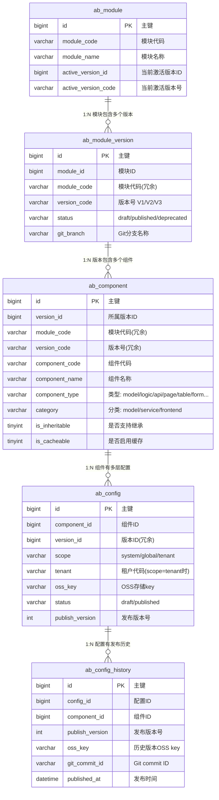

# 存储层设计

> **状态**: 设计中
> **更新日期**: 2025-01-22

---

## 目录

1. [概述](#1-概述)
2. [数据流架构](#2-数据流架构)
3. [表结构设计](#3-表结构设计)
4. [组件类型扩展规范](#4-组件类型扩展规范)
5. [OSS 存储设计](#5-oss-存储设计)
6. [配置设计](#6-配置设计)
7. [缓存策略](#7-缓存策略)
8. [版本管理设计](#8-版本管理设计)
9. [设计决策记录与相关文档](#9-设计决策记录与相关文档)

---

## 1. 概述

### 1.1 核心概念模型

```
┌─────────────────────────────────────────────────────────────────────────────┐
│                              模块 (Module)                                   │
│                            最小配置管理单元                                   │
└─────────────────────────────────────────────────────────────────────────────┘
                                      │
              ┌───────────────────────┼───────────────────────┐
              ▼                       ▼                       ▼
        ┌───────────┐           ┌───────────┐           ┌───────────┐
        │    V1     │           │    V2     │           │    V3     │
        └───────────┘           └───────────┘           └───────────┘
              │
              │  版本对应代码分支，解决开发协同问题，部署可发布多个版本
              ▼
┌─────────────────────────────────────────────────────────────────────────────┐
│                    配置层级 (每个版本内部按层级划分)                           │
│                                                                             │
│  ┌─────────────────────────────────────────────────────────────────────┐   │
│  │                                                                     │   │
│  │   ┌─────────────┐    ┌─────────────┐    ┌─────────────┐           │   │
│  │   │   租户层     │    │   全局层     │    │   系统层     │           │   │
│  │   │  (tenant)   │ ←  │  (global)   │ ←  │  (system)   │           │   │
│  │   └─────────────┘    └─────────────┘    └─────────────┘           │   │
│  │                                                                     │   │
│  │   不同层级之间，以组件粒度继承                                        │   │
│  │   继承方向: 租户 ← 全局 ← 系统                                       │   │
│  └─────────────────────────────────────────────────────────────────────┘   │
│                                                                             │
└─────────────────────────────────────────────────────────────────────────────┘
                      │
                      ▼
┌─────────────────────────────────────────────────────────────────────────────┐
│                      组件 (Component) - 最小配置单元                         │
│                                                                             │
│  ┌─────────────┐     ┌─── 数据模型配置 (model)  ← 组件级继承                │
│  │  数据模型    │─────┤    模型是实体的集合，作为属性骨架被其他组件引用        │
│  └─────────────┘     │    JSON中包含多个实体定义                            │
│                      │                                                     │
│  ┌─────────────┐     ┌─── 逻辑编排配置 (logic)  ← 组件级继承                │
│  │  服务端配置  │─────┤                                                     │
│  └─────────────┘     └─── API接口配置 (api)     ← 组件级继承                │
│                                                                             │
│  ┌─────────────┐     ┌─── 主页面配置 (page)     ← 组件级继承                │
│  │  前端配置    │─────┼─── 表格配置 (table)      ← 组件级继承                │
│  └─────────────┘     ├─── 表单配置 (form)       ← 组件级继承                │
│                      ├─── 过滤器配置 (filter)    ← 组件级继承                │
│                      └─── 打印导出配置 (export)  ← 组件级继承                │
│                      └─── ... (可扩展)                                      │
└─────────────────────────────────────────────────────────────────────────────┘
```

### 1.2 继承规则

**组件级继承，受 `is_inheritable` 属性控制**

```
继承链 (is_inheritable=1): 租户层 ← 全局层 ← 系统层
无继承 (is_inheritable=0): 仅系统层

示例1：租户 T001 请求 order 模块 V1 版本的 "order_main" 实体配置 (可继承)

1. 查找租户层是否有 order_main 实体配置 → 有则使用
2. 没有则查找全局层 order_main 实体配置 → 有则使用
3. 没有则使用系统层 order_main 实体配置 (必须存在)

示例2：请求某个系统级配置 (不可继承, is_inheritable=0)

1. 直接查找系统层配置 → 返回
2. 不查找 global/tenant 层
```

| 配置分类 | 组件类型 | is_inheritable | is_cacheable | 说明 |
|---------|---------|:-------------:|:------------:|------|
| 数据模型 | model | 1 (默认) | 1 (默认) | 可覆盖模型配置，可新增模型 |
| 服务端 | logic / api | 1 (默认) | 1 (默认) | 可覆盖配置，可新增 |
| 前端 | page / table / form 等 | 1 (默认) | 1 (默认) | 可覆盖配置，可新增 |
| 系统配置 | system_config | 0 | 0 | 仅 system 层，不缓存 |

> **设计说明**:
> - `is_inheritable=0` 的组件只能在 system 层创建配置
> - `is_cacheable=0` 的组件每次请求都从数据库读取，适用于需要实时性的配置
> - 两个属性默认都是 1，大多数组件支持完整的继承和缓存机制

### 1.3 技术选型

| 组件 | 技术 | 用途 |
|-----|------|-----|
| 主数据库 | TiDB | 元数据、组件注册表、配置索引 |
| 对象存储 | OSS | 存储配置JSON内容（体积大） |
| 缓存 | Redis | 运行时配置缓存、合并结果缓存 |
| 版本控制 | Gitea | 配置版本历史、审计备份 |

### 1.4 设计原则

1. **TiDB 存索引，OSS 存内容** - 配置JSON体积大，分离存储
2. **统一组件注册表** - 所有配置单元统一管理，便于继承查找
3. **运行时合并** - 配置继承在运行时按需计算
4. **组件类型可扩展** - 存储层只定义规则，具体类型可扩展

---

## 2. 数据流架构

### 2.1 整体架构

```
┌─────────────────────────────────────────────────────────────────────────────┐
│                                设计器                                        │
└─────────────────────────────────────────────────────────────────────────────┘
                                      │
                                      ▼ 保存/发布
┌─────────────────────────────────────────────────────────────────────────────┐
│                             TiDB (索引存储)                                  │
│                                                                             │
│  ┌─────────────┐  ┌─────────────┐  ┌─────────────┐  ┌─────────────┐         │
│  │ ab_module   │  │ ab_version  │  │ab_component │  │ ab_config   │         │
│  │  模块定义    │  │  版本定义    │  │  组件注册   │  │  配置索引    │         │
│  └─────────────┘  └─────────────┘  └─────────────┘  └─────────────┘         │
│                                                                             │
└─────────────────────────────────────────────────────────────────────────────┘
                                      │
                                      │ oss_key
                                      ▼
┌─────────────────────────────────────────────────────────────────────────────┐
│                             OSS (内容存储)                                   │
│                                                                             │
│     /{scope}/{module}/{version}/{component_type}/{component_code}.json      │
│                                                                             │
└─────────────────────────────────────────────────────────────────────────────┘
                                      │
                    ┌─────────────────┼─────────────────┐
                    ▼                                   ▼
          ┌─────────────────┐                 ┌─────────────────┐
          │     Redis       │                 │     Gitea       │
          │   运行时缓存     │                 │   版本历史       │
          │   合并结果缓存   │                 │   审计备份       │
          └─────────────────┘                 └─────────────────┘
                    │
                    ▼
┌─────────────────────────────────────────────────────────────────────────────┐
│                              前端渲染器                                      │
└─────────────────────────────────────────────────────────────────────────────┘
```

### 2.2 数据流说明

| 场景 | 数据流 |
|-----|-------|
| 保存草稿 | 设计器 → TiDB(status=draft) + OSS(**草稿路径**) |
| 发布配置 | OSS(草稿→发布路径) → TiDB(status=published) → Redis(清除旧缓存) → Gitea(异步备份) |
| 运行时读取 | Redis缓存 → (miss) → TiDB(**仅查published**) → OSS(**发布路径**) → 写入缓存 |
| 版本回滚 | Gitea(历史) → OSS(恢复到发布路径) → TiDB(状态) → Redis(清除) |

> **关键设计**: 草稿和已发布配置存储在不同的 OSS 路径，运行时只读取已发布配置，确保草稿不会被误读

### 2.3 数据流向图

#### 2.3.1 保存草稿流程

```
┌──────────┐
│  设计器   │
└────┬─────┘
     │ ① 保存请求
     ▼
┌──────────┐     ② 写入索引      ┌──────────┐
│  服务层   │ ─────────────────▶ │   TiDB   │
└────┬─────┘                    │ ab_config │
     │                          │ status=   │
     │ ③ 上传内容                │  draft    │
     ▼                          └──────────┘
┌──────────┐
│   OSS    │  草稿路径: .../draft/_system.json
└──────────┘
```

> **注意**: 草稿内容存储在 `draft/` 子目录下，与发布内容隔离

#### 2.3.2 发布配置流程

```
┌──────────┐
│  设计器   │
└────┬─────┘
     │ ① 发布请求
     ▼
┌──────────┐     ② 复制OSS内容    ┌──────────┐
│  服务层   │ ─────────────────▶ │   OSS    │
└────┬─────┘                    │ draft/ → │
     │                          │ published│
     │ ③ 更新状态               └──────────┘
     ▼
┌──────────┐
│   TiDB   │  status = published, oss_key 指向发布路径
└────┬─────┘
     │
     │ ④ 清除缓存
     ▼
┌──────────┐
│  Redis   │  DEL assembox:{tenant}:resolved:...
└────┬─────┘
     │
     │ ⑤ 异步备份 (消息队列)
     ▼
┌──────────┐
│  Gitea   │  git commit + push
└──────────┘
```

> **关键步骤**: 发布时将草稿路径的内容复制到发布路径，确保运行时只能读取已发布内容

#### 2.3.3 运行时读取流程

```
┌──────────┐
│  渲染器   │
└────┬─────┘
     │ ① 请求配置
     ▼
┌──────────┐     ② 查询组件特性    ┌──────────┐
│  服务层   │ ─────────────────▶  │   TiDB   │
└────┬─────┘                     │ab_component│
     │                           │is_cacheable│
     │                           └────┬───────┘
     │                                │
     │               ┌────────────────┴────────────────┐
     │               │                                 │
     │         is_cacheable=1                   is_cacheable=0
     │               │                                 │
     │               ▼                                 │
     │        ③ 查询缓存                               │
     │               │                                 │
     │      ┌────────┴────────┐                       │
     │      │                 │                       │
     │    命中              未命中                     │
     │      │                 │                       │
     │      ▼                 ▼                       ▼
     │ ┌──────────┐    ④ 查询索引              ④ 直接查询索引
     │ │ 返回配置  │          │                       │
     │ └──────────┘          ▼                       ▼
     │                  ┌──────────┐           ┌──────────┐
     │                  │   TiDB   │           │   TiDB   │
     │                  │ 按层级查找 │           │ 仅system层│
     │                  │ status=  │           │ status=  │
     │                  │ published│           │ published│
     │                  └────┬─────┘           └────┬─────┘
     │                       │                      │
     │              ⑤ 获取OSS内容                   │
     │                       ▼                      ▼
     │                  ┌──────────┐           ┌──────────┐
     │                  │   OSS    │           │   OSS    │
     │                  │ 发布路径  │           │ 发布路径  │
     │                  └────┬─────┘           └────┬─────┘
     │                       │                      │
     │              ⑥ 写入缓存                      │
     │                       ▼                      │
     │                  ┌──────────┐                │
     │◀─────────────────│  Redis   │ ◀─────────────┘
     │     ⑦ 返回配置   └──────────┘    (不写缓存，直接返回)
     ▼
┌──────────┐
│  渲染页面 │
└──────────┘
```

> **关键逻辑**:
> 1. 根据 `is_cacheable` 决定是否走缓存
> 2. 根据 `is_inheritable` 决定是按层级查找还是仅查 system 层
> 3. **只查询 status=published 的配置**，草稿配置对运行时不可见
> 4. OSS 读取的是**发布路径**，不是草稿路径

#### 2.3.4 版本回滚流程

```
┌──────────┐
│  管理后台 │
└────┬─────┘
     │ ① 回滚请求 (指定版本号)
     ▼
┌──────────┐     ② 获取历史版本    ┌──────────┐
│  服务层   │ ─────────────────▶  │  Gitea   │
└────┬─────┘                     │ checkout │
     │                           │ v{N}     │
     │ ③ 恢复配置内容             └────┬─────┘
     ▼                                │
┌──────────┐◀─────────────────────────┘
│   OSS    │  上传历史版本JSON
└────┬─────┘
     │
     │ ④ 更新索引
     ▼
┌──────────┐
│   TiDB   │  publish_version++, oss_key 更新
└────┬─────┘
     │
     │ ⑤ 清除缓存
     ▼
┌──────────┐
│  Redis   │  DEL assembox:{tenant}:resolved:...
└──────────┘
```

---

## 3. 表结构设计

### 3.1 模块表 (ab_module)

```sql
CREATE TABLE ab_module (
    -- 主键
    id              BIGINT NOT NULL COMMENT '主键',

    -- 模块标识
    module_code     VARCHAR(100) NOT NULL COMMENT '模块代码',
    module_name     VARCHAR(200) NOT NULL COMMENT '模块名称',
    description     VARCHAR(500) COMMENT '模块描述',

    -- 当前激活版本
    active_version_id   BIGINT COMMENT '当前激活版本ID',
    active_version_code VARCHAR(20) COMMENT '当前激活版本号',

    -- 审计字段 (BaseEntity)
    created_at      DATETIME DEFAULT CURRENT_TIMESTAMP,
    creator_id      BIGINT,
    creator_name    VARCHAR(50),
    modifier_at     DATETIME DEFAULT CURRENT_TIMESTAMP ON UPDATE CURRENT_TIMESTAMP,
    modifier_id     BIGINT,
    modifier_name   VARCHAR(50),
    is_removed      TINYINT(1) DEFAULT 0,
    version         BIGINT DEFAULT 0,

    -- 启用/排序 (HasEnableEntity)
    sort_code       INT,
    is_enable       TINYINT(1) DEFAULT 1,

    PRIMARY KEY (id)
) COMMENT '模块定义表';
```

### 3.2 版本表 (ab_module_version)

```sql
CREATE TABLE ab_module_version (
    -- 主键
    id              BIGINT NOT NULL COMMENT '主键',

    -- 关联模块
    module_id       BIGINT NOT NULL COMMENT '模块ID',
    module_code     VARCHAR(100) NOT NULL COMMENT '模块代码（冗余）',

    -- 版本信息
    version_code    VARCHAR(20) NOT NULL COMMENT '版本号，如 V1、V2、V3',
    version_name    VARCHAR(100) COMMENT '版本名称',
    description     VARCHAR(500) COMMENT '版本说明',

    -- 版本状态
    status          VARCHAR(20) NOT NULL DEFAULT 'draft' COMMENT 'draft/published/deprecated',
    published_at    DATETIME COMMENT '首次发布时间',

    -- 关联代码分支
    git_branch      VARCHAR(100) COMMENT 'Git分支名称，格式: {module_code}/{version_code}',

    -- 审计字段
    created_at      DATETIME DEFAULT CURRENT_TIMESTAMP,
    creator_id      BIGINT,
    creator_name    VARCHAR(50),
    modifier_at     DATETIME DEFAULT CURRENT_TIMESTAMP ON UPDATE CURRENT_TIMESTAMP,
    modifier_id     BIGINT,
    modifier_name   VARCHAR(50),
    is_removed      TINYINT(1) DEFAULT 0,
    version         BIGINT DEFAULT 0,

    sort_code       INT,
    is_enable       TINYINT(1) DEFAULT 1,

    PRIMARY KEY (id)
) COMMENT '模块版本表';
```

### 3.3 组件注册表 (ab_component)

> **统一管理所有配置单元（组件）**，包括数据模型，是继承查找的基础

```sql
CREATE TABLE ab_component (
    -- 主键
    id              BIGINT NOT NULL COMMENT '主键',

    -- 关联版本
    version_id      BIGINT NOT NULL COMMENT '所属版本ID',
    module_code     VARCHAR(100) NOT NULL COMMENT '模块代码（冗余）',
    version_code    VARCHAR(20) NOT NULL COMMENT '版本号（冗余）',

    -- 组件标识
    component_code  VARCHAR(100) NOT NULL COMMENT '组件代码',
    component_name  VARCHAR(200) NOT NULL COMMENT '组件名称',
    component_type  VARCHAR(50) NOT NULL COMMENT '组件类型',

    -- 组件分类（用于UI展示和管理）
    category        VARCHAR(50) NOT NULL COMMENT '分类: model/service/frontend',

    -- 组件特性
    is_inheritable  TINYINT(1) DEFAULT 1 COMMENT '是否支持继承，0=仅system层，1=支持三层继承',
    is_cacheable    TINYINT(1) DEFAULT 1 COMMENT '是否启用缓存，0=直接读库，1=走Redis缓存',

    -- 组件说明
    description     VARCHAR(500) COMMENT '组件描述',

    -- 审计字段
    created_at      DATETIME DEFAULT CURRENT_TIMESTAMP,
    creator_id      BIGINT,
    creator_name    VARCHAR(50),
    modifier_at     DATETIME DEFAULT CURRENT_TIMESTAMP ON UPDATE CURRENT_TIMESTAMP,
    modifier_id     BIGINT,
    modifier_name   VARCHAR(50),
    is_removed      TINYINT(1) DEFAULT 0,
    version         BIGINT DEFAULT 0,

    sort_code       INT,
    is_enable       TINYINT(1) DEFAULT 1,

    PRIMARY KEY (id)
) COMMENT '组件注册表';
```

### 3.4 配置索引表 (ab_config)

> 存储**各层级**的配置索引，指向OSS中的实际内容

```sql
CREATE TABLE ab_config (
    -- 主键
    id              BIGINT NOT NULL COMMENT '主键',

    -- 关联组件
    component_id    BIGINT NOT NULL COMMENT '组件ID',
    version_id      BIGINT NOT NULL COMMENT '版本ID（冗余）',
    module_code     VARCHAR(100) NOT NULL COMMENT '模块代码（冗余）',
    version_code    VARCHAR(20) NOT NULL COMMENT '版本号（冗余）',
    component_code  VARCHAR(100) NOT NULL COMMENT '组件代码（冗余）',
    component_type  VARCHAR(50) NOT NULL COMMENT '组件类型（冗余）',

    -- 配置层级
    scope           VARCHAR(20) NOT NULL COMMENT 'system/global/tenant',
    tenant          VARCHAR(64) COMMENT 'scope=tenant时必填',

    -- OSS存储
    oss_key         VARCHAR(500) NOT NULL COMMENT 'OSS存储key',
    content_hash    VARCHAR(64) COMMENT '内容MD5哈希，用于变更检测',
    content_size    INT COMMENT '内容大小(字节)',

    -- 发布状态
    status          VARCHAR(20) NOT NULL DEFAULT 'draft' COMMENT 'draft/published',
    publish_version INT NOT NULL DEFAULT 0 COMMENT '发布版本号（每次发布+1）',
    published_at    DATETIME COMMENT '最后发布时间',

    -- 审计字段
    created_at      DATETIME DEFAULT CURRENT_TIMESTAMP,
    creator_id      BIGINT,
    creator_name    VARCHAR(50),
    modifier_at     DATETIME DEFAULT CURRENT_TIMESTAMP ON UPDATE CURRENT_TIMESTAMP,
    modifier_id     BIGINT,
    modifier_name   VARCHAR(50),
    is_removed      TINYINT(1) DEFAULT 0,
    version         BIGINT DEFAULT 0,

    sort_code       INT,
    is_enable       TINYINT(1) DEFAULT 1,

    PRIMARY KEY (id)
) COMMENT '配置索引表';
```

### 3.5 配置发布历史表 (ab_config_history)

```sql
CREATE TABLE ab_config_history (
    -- 主键
    id              BIGINT NOT NULL COMMENT '主键',

    -- 关联配置
    config_id       BIGINT NOT NULL COMMENT '配置ID',
    component_id    BIGINT NOT NULL COMMENT '组件ID',

    -- 发布信息
    publish_version INT NOT NULL COMMENT '发布版本号',
    oss_key         VARCHAR(500) NOT NULL COMMENT '历史版本OSS key',
    content_hash    VARCHAR(64) COMMENT '内容哈希',

    -- Git信息
    git_commit_id   VARCHAR(64) COMMENT 'Git commit ID',

    -- 发布人
    published_at    DATETIME NOT NULL,
    publisher_id    BIGINT,
    publisher_name  VARCHAR(50),

    -- 审计字段
    created_at      DATETIME DEFAULT CURRENT_TIMESTAMP,
    is_removed      TINYINT(1) DEFAULT 0,

    PRIMARY KEY (id)
) COMMENT '配置发布历史表';
```

### 3.6 ER图

> 注：表之间通过 ID 字段关联，不使用数据库外键约束（虚线表示逻辑关联）



---

## 4. 组件类型扩展规范

### 4.1 组件分类与类型

| 分类 (category) | 组件类型 (component_type) | 说明 |
|----------------|--------------------------|------|
| model | `model` | 数据模型配置（包含多个实体定义） |
| service | `logic` | 逻辑编排配置 |
| service | `api` | API接口配置 |
| frontend | `page` | 主页面配置 |
| frontend | `table` | 表格配置 |
| frontend | `form` | 表单配置 |
| frontend | `filter` | 过滤器配置 |
| frontend | `export` | 打印导出配置 |
| ... | ... | 可扩展 |

### 4.2 组件类型扩展

> 详细设计见 [组件类型扩展规范](./component-types.md)

---

## 5. OSS 存储设计

### 5.1 存储路径规范

> **设计原则**：
> 1. 将 scope 和 tenant 放在路径末尾，便于用前缀匹配一次查出所有层级配置
> 2. **草稿和发布内容分离存储**，运行时只读取发布路径

```
assembox/
│
├── draft/                                        # 草稿区（设计器编辑用）
│   └── {module_code}/
│       └── {version_code}/
│           └── {component_type}/
│               └── {component_code}/
│                   ├── _system.json
│                   ├── _global.json
│                   └── _tenant_{tenant_code}.json
│
└── published/                                    # 发布区（运行时读取）
    └── {module_code}/
        └── {version_code}/
            └── {component_type}/
                └── {component_code}/
                    ├── _system.json              # 系统层配置
                    ├── _global.json              # 全局层配置
                    └── _tenant_{tenant_code}.json # 租户层配置
```

**示例：订单模块的配置目录结构**

```
assembox/
│
├── draft/                                        # 草稿区
│   └── order/
│       └── V1/
│           └── table/
│               └── order_table/
│                   └── _system.json              # 设计器正在编辑的草稿
│
└── published/                                    # 发布区（运行时读取）
    └── order/
        └── V1/
            ├── model/
            │   └── order_model/
            │       ├── _system.json              # 系统层数据模型
            │       └── _global.json              # 全局层覆盖（如有）
            │
            ├── table/
            │   └── order_table/
            │       ├── _system.json
            │       ├── _global.json
            │       └── _tenant_T001.json         # 租户T001的表格配置
            │
            ├── form/
            │   └── order_form/
            │       ├── _system.json
            │       └── _tenant_T001.json
            │
            └── page/
                └── order_list/
                    └── _system.json
```

> **关键说明**：
> - **设计器**读写 `draft/` 路径
> - **运行时**只读 `published/` 路径
> - **发布操作**将 `draft/` 内容复制到 `published/`
> - 这样保证即使不走缓存，运行时也不会读到未发布的草稿

### 5.2 OSS Key 生成规则

```typescript
interface ConfigInfo {
    scope: 'system' | 'global' | 'tenant';
    tenant?: string;
    moduleCode: string;
    versionCode: string;
    componentType: string;
    componentCode: string;
}

type OssArea = 'draft' | 'published';

function generateOssKey(config: ConfigInfo, area: OssArea): string {
    const scopeSuffix = config.scope === 'system'
        ? '_system'
        : config.scope === 'global'
            ? '_global'
            : `_tenant_${config.tenant}`;

    return `assembox/${area}/${config.moduleCode}/${config.versionCode}/${config.componentType}/${config.componentCode}/${scopeSuffix}.json`;
}

// 草稿路径示例 (设计器使用):
// assembox/draft/order/V1/model/order_model/_system.json
// assembox/draft/order/V1/table/order_table/_global.json

// 发布路径示例 (运行时使用):
// assembox/published/order/V1/model/order_model/_system.json
// assembox/published/order/V1/table/order_table/_global.json
// assembox/published/order/V1/form/order_form/_tenant_T001.json
```

### 5.3 批量查询优势

```typescript
// 查询某个组件的所有层级配置（一次 OSS list 操作）
// 注意：运行时只查询 published 路径
const prefix = `assembox/published/${moduleCode}/${versionCode}/${componentType}/${componentCode}/`;

// 返回结果示例:
// - assembox/published/order/V1/table/order_table/_system.json
// - assembox/published/order/V1/table/order_table/_global.json
// - assembox/published/order/V1/table/order_table/_tenant_T001.json
// - assembox/published/order/V1/table/order_table/_tenant_T002.json

// 服务端按优先级排序后返回首个匹配（tenant > global > system）
function resolveConfig(files: string[], tenantCode: string): string | null {
    const tenantFile = `_tenant_${tenantCode}.json`;

    // 优先级: tenant > global > system
    if (files.includes(tenantFile)) return tenantFile;
    if (files.includes('_global.json')) return '_global.json';
    if (files.includes('_system.json')) return '_system.json';
    return null;
}
```

> 详细设计见 [OSS操作规范](./oss-operations.md)

---

## 6. 配置设计

### 6.1 配置JSON结构示例

#### 6.1.1 数据模型配置 (model)

> 数据模型是实体的集合，作为属性骨架被其他组件引用

```json
{
    "$schema": "assembox/model/v1",
    "componentCode": "order_model",
    "componentName": "订单数据模型",
    "description": "订单模块的数据模型定义",
    "entities": {
        "order_main": {
            "entityName": "订单主表",
            "tableName": "t_order",
            "role": "main",
            "fields": [
                {
                    "fieldCode": "id",
                    "fieldName": "主键",
                    "fieldType": "bigint",
                    "primaryKey": true
                },
                {
                    "fieldCode": "order_no",
                    "fieldName": "订单号",
                    "fieldType": "string",
                    "length": 32,
                    "required": true
                },
                {
                    "fieldCode": "amount",
                    "fieldName": "订单金额",
                    "fieldType": "decimal",
                    "precision": 10,
                    "scale": 2
                }
            ]
        },
        "order_item": {
            "entityName": "订单明细",
            "tableName": "t_order_item",
            "role": "detail",
            "parentEntity": "order_main",
            "fields": [
                {
                    "fieldCode": "id",
                    "fieldName": "主键",
                    "fieldType": "bigint",
                    "primaryKey": true
                },
                {
                    "fieldCode": "order_id",
                    "fieldName": "订单ID",
                    "fieldType": "bigint",
                    "foreignKey": "order_main.id"
                },
                {
                    "fieldCode": "product_name",
                    "fieldName": "商品名称",
                    "fieldType": "string",
                    "length": 200
                },
                {
                    "fieldCode": "quantity",
                    "fieldName": "数量",
                    "fieldType": "int"
                }
            ]
        }
    }
}
```

#### 6.1.2 表格配置 (table)

```json
{
    "$schema": "assembox/table/v1",
    "componentCode": "order_table",
    "componentName": "订单列表表格",
    "modelRef": "order_model",
    "entityRef": "order_main",
    "columns": [
        { "field": "order_no", "label": "订单号", "width": 150 },
        { "field": "amount", "label": "金额", "width": 100, "formatter": "currency" },
        { "field": "status", "label": "状态", "width": 80, "formatter": "dict:order_status" }
    ],
    "pagination": { "pageSize": 20 }
}
```

### 6.2 配置继承与合并

#### 6.2.1 继承查找算法

```typescript
interface LoadContext {
    moduleCode: string;
    versionCode: string;
    componentType: string;
    componentCode: string;
    tenant: string;
}

interface ComponentMeta {
    isInheritable: boolean;
    isCacheable: boolean;
}

/**
 * 加载配置（支持继承特性和缓存特性控制）
 */
async function loadConfig(ctx: LoadContext): Promise<any> {
    // 1. 获取组件元信息
    const meta = await getComponentMeta(ctx);

    // 2. 根据缓存特性决定是否查缓存
    if (meta.isCacheable) {
        const cacheKey = `assembox:config:${ctx.tenant}:${ctx.moduleCode}:${ctx.versionCode}:${ctx.componentType}:${ctx.componentCode}`;
        const cached = await redis.get(cacheKey);
        if (cached) return JSON.parse(cached);
    }

    // 3. 根据继承特性决定查找范围
    let config: any = null;
    if (meta.isInheritable) {
        // 支持继承：按优先级查找 (tenant > global > system)
        // 注意：只查 status=published 的记录
        config = await loadConfigFromScope('tenant', ctx);
        if (!config) config = await loadConfigFromScope('global', ctx);
        if (!config) config = await loadConfigFromScope('system', ctx);
    } else {
        // 不支持继承：只查 system 层
        config = await loadConfigFromScope('system', ctx);
    }

    if (!config) {
        throw new Error(`Component not found: ${ctx.componentType}/${ctx.componentCode}`);
    }

    // 4. 根据缓存特性决定是否写缓存
    if (meta.isCacheable) {
        const cacheKey = `assembox:config:${ctx.tenant}:${ctx.moduleCode}:${ctx.versionCode}:${ctx.componentType}:${ctx.componentCode}`;
        await redis.setex(cacheKey, 3600, JSON.stringify(config));
    }

    return config;
}

/**
 * 从指定 scope 加载配置
 * 只查询 status=published 的配置
 * OSS 读取 published 路径
 */
async function loadConfigFromScope(scope: string, ctx: LoadContext): Promise<any> {
    // 从 TiDB 查询配置索引（只查 published 状态）
    const configIndex = await db.query(`
        SELECT oss_key FROM ab_config
        WHERE module_code = ? AND version_code = ?
          AND component_type = ? AND component_code = ?
          AND scope = ? AND (tenant = ? OR tenant IS NULL)
          AND status = 'published'
          AND is_removed = 0
    `, [ctx.moduleCode, ctx.versionCode, ctx.componentType, ctx.componentCode, scope, ctx.tenant]);

    if (!configIndex) return null;

    // 从 OSS published 路径读取内容
    return await oss.get(configIndex.oss_key);
}
```

#### 6.2.2 继承场景示例

```
场景：租户 T001 请求 order 模块 V1 版本的 order_table 表格配置

数据库中的配置记录:
┌──────────────┬───────────────┬─────────┬────────┐
│ comp_type    │ comp_code     │ scope   │ tenant │
├──────────────┼───────────────┼─────────┼────────┤
│ table        │ order_table   │ system  │ NULL   │  ← 系统层基础配置
│ table        │ order_table   │ global  │ NULL   │  ← 全局层覆盖
│ table        │ order_table   │ tenant  │ T001   │  ← T001租户覆盖
│ table        │ order_table   │ tenant  │ T002   │  ← T002租户覆盖
└──────────────┴───────────────┴─────────┴────────┘

T001 查找流程:
1. 查找 scope=tenant, tenant=T001 → 找到 → 返回T001配置
2. (若T001没有) 查找 scope=global → 找到 → 返回全局配置
3. (若全局也没有) 查找 scope=system → 找到 → 返回系统配置
```

> 详细设计见 [配置详细设计](./config-detail.md)

---

## 7. 缓存策略

### 7.1 缓存层次

```
┌─────────────────────────────────────────────────────────────────────────────┐
│                              Redis 缓存                                      │
├─────────────────────────────────────────────────────────────────────────────┤
│  L1: 租户配置缓存 (继承查找结果)                                              │
│      Key: assembox:config:{tenant}:{module}:{version}:{type}:{code}         │
│      TTL: 1h                                                                │
│      说明: 租户实际使用的配置，已完成继承查找                                  │
│      **仅 is_cacheable=1 的组件使用此缓存**                                   │
├─────────────────────────────────────────────────────────────────────────────┤
│  L2: 原始配置缓存                                                            │
│      Key: assembox:raw:{scope}:{module}:{version}:{type}:{code}             │
│      TTL: 30min                                                             │
│      说明: 从OSS加载的原始配置，用于加速继承查找                               │
│      **仅 is_cacheable=1 的组件使用此缓存**                                   │
├─────────────────────────────────────────────────────────────────────────────┤
│  L3: 组件列表缓存                                                            │
│      Key: assembox:components:{module}:{version}:{category}                 │
│      TTL: 10min                                                             │
│      说明: 版本下某分类的组件列表                                             │
└─────────────────────────────────────────────────────────────────────────────┘
```

### 7.2 缓存判断逻辑

```typescript
async function loadConfig(ctx: LoadContext): Promise<any> {
    // 1. 获取组件元信息
    const component = await getComponent(ctx);

    // 2. 不可缓存的组件，直接查库
    if (!component.isCacheable) {
        return await loadFromDatabase(ctx, component.isInheritable);
    }

    // 3. 可缓存的组件，走缓存逻辑
    const cacheKey = buildCacheKey(ctx);
    const cached = await redis.get(cacheKey);
    if (cached) return JSON.parse(cached);

    // 4. 缓存未命中，查库并写入缓存
    const config = await loadFromDatabase(ctx, component.isInheritable);
    await redis.setex(cacheKey, 3600, JSON.stringify(config));

    return config;
}

async function loadFromDatabase(ctx: LoadContext, isInheritable: boolean): Promise<any> {
    if (isInheritable) {
        // 按优先级查找: tenant > global > system
        // 只查 status=published 的记录
        return await findByPriority(ctx, ['tenant', 'global', 'system']);
    } else {
        // 只查 system 层
        return await findSystemOnly(ctx);
    }
}
```

### 7.3 缓存失效策略

| 事件 | 缓存操作 |
|-----|---------|
| 发布系统层配置 | 清除该组件所有租户的L1缓存 + L2 system缓存 |
| 发布全局层配置 | 清除该组件所有租户的L1缓存 + L2 global缓存 |
| 发布租户层配置 | 清除该租户该组件的L1缓存 + L2 tenant缓存 |
| 新增/删除组件 | 清除该版本的L3组件列表缓存 |
| 版本切换 | 清除该模块所有缓存 |

> 详细设计见 [缓存策略详细设计](./cache-strategy.md)

---

## 8. 版本管理设计

### 8.1 版本生命周期

```
┌─────────┐     发布      ┌─────────────┐     废弃      ┌─────────────┐
│  draft  │ ───────────▶ │  published  │ ───────────▶ │ deprecated  │
│  草稿   │              │    已发布    │              │    已废弃    │
└─────────┘              └─────────────┘              └─────────────┘
```

| 状态 | 说明 | 允许的操作 |
|-----|------|-----------|
| draft | 草稿状态，开发中 | 编辑、删除、发布 |
| published | 已发布，运行时可用 | 编辑（生成新配置版本）、废弃 |
| deprecated | 已废弃，不再使用 | 恢复到 published |

### 8.2 Git 分支策略

> **核心设计**：模块版本与 Git 分支一一对应，便于版本隔离和历史追溯

```
Git 仓库分支结构：
│
├── main                         # 默认分支（仅用于初始化，不直接操作）
│
├── order/V1                     # 订单模块 V1 版本
├── order/V2                     # 订单模块 V2 版本
├── order/V3                     # 订单模块 V3 版本
│
├── product/V1                   # 商品模块 V1 版本
├── product/V2                   # 商品模块 V2 版本
│
└── user/V1                      # 用户模块 V1 版本
```

**分支命名规范：**

```
{module_code}/{version_code}

示例：
- order/V1
- order/V2
- product/V1
```

### 8.3 同步时机

| 事件 | 是否同步 | 说明 |
|-----|---------|------|
| 保存草稿 | 否 | 仅存入TiDB + OSS |
| 发布配置 | **是** | 异步同步到对应分支 |
| 回滚配置 | **是** | 记录回滚操作 |
| 创建新版本 | **是** | 从旧版本分支创建新分支 |

### 8.4 提交信息格式

```
[{scope}] {action}: {type}/{code} (v{publish_version})

示例:
[system] publish: model/order_model (v1)
[global] publish: table/order_table (v3)
[tenant:T001] publish: form/order_form (v2)
[system] rollback: model/order_model (v3 -> v2)

```

> 详细设计见 [版本管理详细设计](./version-management.md)

---

## 9. 设计决策记录与相关文档

### 9.1 设计决策记录

| 问题 | 决策 | 说明 |
|-----|------|------|
| 配置层级位置 | 版本内部分层 | 每个版本按 system/global/tenant 分层 |
| 数据模型管理 | 作为组件处理 | 数据模型是组件的一种类型(model)，JSON中包含多个实体定义 |
| 组件管理 | 统一组件注册表 | ab_component 统一管理所有配置单元 |
| 继承粒度 | 组件级继承 | 所有配置类型都以组件为最小继承单元 |
| 继承特性控制 | is_inheritable 属性 | 0=仅system层，1=支持三层继承，默认为1 |
| 缓存特性控制 | is_cacheable 属性 | 0=不缓存直接读库，1=走Redis缓存，默认为1 |
| 存储方式 | TiDB索引 + OSS内容 | 配置JSON体积大，分离存储 |
| OSS路径设计 | draft/published 分离 | 草稿和发布内容隔离，运行时只读published路径 |
| 合并时机 | 运行时查找 | 按优先级返回首个匹配配置 |
| 草稿与发布隔离 | OSS路径分离 + 状态过滤 | 运行时只查published状态，只读published路径 |
| 系统层修改 | 可修改重发布 | 修改后重新发布影响所有下层 |
| 组件类型 | 可扩展 | model/logic/api/page/table/form等，可按需扩展 |
| Git分支策略 | 版本对应分支 | {module}/{version} 格式，版本隔离、历史清晰 |

### 9.2 相关文档

| 序号 | 对应章节 | 文档 | 状态 | 主要内容 |
|:---:|---------|-----|:----:|---------|
| 1 | §4 组件类型 | [组件类型扩展规范](./component-types.md) | ✅ | 组件类型定义、注册机制、扩展流程、分类映射 |
| 2 | §5 OSS存储 | [OSS操作规范](./oss-operations.md) | ✅ | 读写接口、批量操作、错误重试、大文件处理 |
| 3 | §6 配置设计 | [配置详细设计](./config-detail.md) | ✅ | JSON Schema定义、继承查找算法、批量加载、特殊场景 |
| 4 | §7 缓存策略 | [缓存策略详细设计](./cache-strategy.md) | ✅ | 三层缓存、读取流程、失效策略、预热、降级容错 |
| 5 | §8 版本管理 | [版本管理详细设计](./version-management.md) | ✅ | 版本生命周期、Git仓库结构、同步机制、历史查询、灾难恢复 |

> 图例: ✅ 已完成 | 📝 待编写
